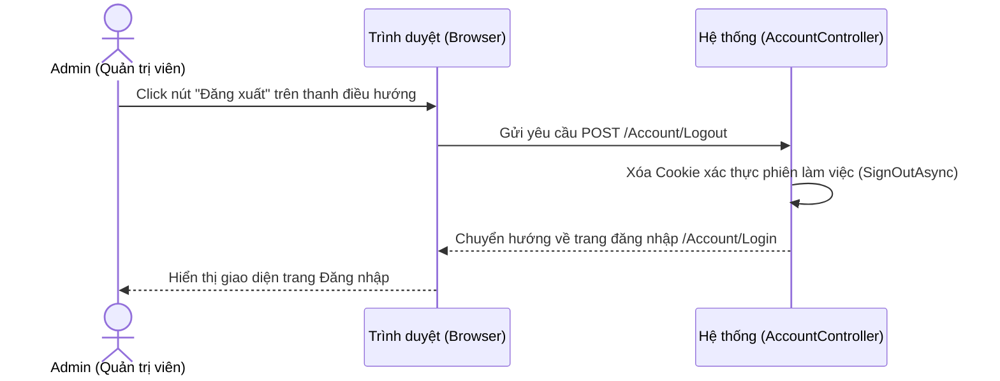

# BÁO CÁO ĐỒ ÁN TỐT NGHIỆP
## ĐỀ TÀI: XÂY DỰNG HỆ THỐNG QUẢN LÝ SHOWROOM Ô TÔ AUTOPRO (QUANLYGARA)

---

## MỞ ĐẦU
Ngành công nghiệp và thị trường giao dịch xe ô tô là một lĩnh vực quan trọng và thiết yếu trong cuộc sống hiện đại của con người. Khách hàng ngày nay không chỉ đặt mua các dòng xe phổ thông có sẵn mà còn tìm kiếm những mẫu xe thể thao cao cấp, xe nhập khẩu nguyên chiếc được thiết kế chuyên biệt từ các hãng xe danh tiếng, dẫn đến việc giao dịch, ký kết hợp đồng mua bán xe giữa khách hàng và các showroom ô tô ngày càng gia tăng mạnh mẽ. 

Trước đây, việc quản lý kho xe, theo dõi trạng thái xe (sẵn sàng hay đã bán) và lập hợp đồng mua bán tại các showroom vẫn còn thực hiện theo phương thức truyền thống như ghi chép sổ tay hoặc sử dụng các tệp tin Excel rời rạc. Cùng với sự phát triển vượt bậc của cuộc cách mạng công nghiệp 4.0, việc tin học hóa quy trình quản lý showroom ô tô đã ra đời như một nhu cầu tất yếu để nâng cao hiệu quả vận hành.

Hệ thống quản lý showroom ô tô AutoPro (QuanLyGara) giúp người quản trị dễ dàng kiểm soát chi tiết thông tin xe, đồng bộ hóa quy trình giao dịch mua bán và theo dõi báo cáo doanh thu một cách nhanh chóng. Ngoài ra, ứng dụng còn cho phép nhân viên kinh doanh dễ dàng cập nhật danh sách xe, nắm bắt tức thời tình trạng kho xe để tư vấn cho khách hàng. Đây là giải pháp công nghệ toàn diện giúp các showroom tối ưu hóa bộ máy quản lý, quản trị nhân sự hiệu quả và gia tăng tối đa doanh số bán hàng.

---

## TỔNG QUAN ĐỀ TÀI

### 1. Lý do chọn đề tài
Trong thời đại cách mạng công nghiệp 4.0 và chuyển đổi số mạnh mẽ, việc ứng dụng công nghệ thông tin vào quản lý kinh doanh đã trở thành xu thế tất yếu cho mọi ngành nghề. Ngành kinh doanh ô tô tại Việt Nam đang có những bước phát triển vượt bậc với số lượng phương tiện bán ra tăng trưởng hàng năm. Tuy nhiên, việc quản lý một showroom ô tô đòi hỏi tính chính xác cực kỳ cao về thông tin kỹ thuật (số khung, số máy, hãng xe, dòng xe), hình ảnh trực quan sản phẩm, thông tin nhân sự và các giao dịch hợp đồng mua bán với giá trị lớn.

Hiện nay, nhiều showroom ô tô quy mô vừa và nhỏ vẫn đang áp dụng các phương pháp quản lý thủ công truyền thống như ghi chép sổ sách hoặc sử dụng các tệp tin Excel rời rạc. Phương pháp này bộc lộ nhiều hạn chế:
- **Dễ sai sót dữ liệu**: Việc nhập tay số khung số máy dài dễ dẫn đến nhầm lẫn, ảnh hưởng đến thủ tục đăng ký xe và giao dịch pháp lý.
- **Thiếu tính đồng bộ**: Khi một xe đã được bán, việc cập nhật trạng thái kho xe không được tự động hóa, dẫn đến tình trạng nhân viên kinh doanh khác vẫn tư vấn hoặc tạo đơn trùng lặp.
- **Không có tính trực quan**: Người quản lý gặp khó khăn trong việc theo dõi tổng doanh thu, doanh số bán hàng tức thời và đánh giá hiệu suất làm việc của từng nhân viên nếu không có các biểu đồ phân tích trực quan.

Từ những lý do thực tiễn trên, tôi quyết định lựa chọn đề tài: **"Xây dựng hệ thống quản lý showroom ô tô AutoPro (QuanLyGara)"** trên nền tảng công nghệ ASP.NET Core MVC nhằm số hóa toàn diện quy trình vận hành, mang đến một giao diện quản trị hiện đại, tự động hóa nghiệp vụ bán hàng và nâng cao hiệu quả quản lý cho các showroom ô tô.

### 2. Mục tiêu nghiên cứu
Xây dựng một hệ thống website quản trị nội bộ chuyên nghiệp cho showroom ô tô AutoPro nhằm tối ưu hóa việc quản lý xe, nhân sự và đơn hàng mua bán. Cụ thể:
- **Xây dựng chức năng nghiệp vụ**: Thiết lập các mô-đun quản lý kho xe (trạng thái sẵn sàng/đã bán), quản lý hình ảnh chi tiết của xe, quản lý hồ sơ nhân viên và lập đơn hàng bán xe.
- **Tự động hóa logic đồng bộ dữ liệu**: Khi lập đơn hàng, trạng thái xe sẽ tự động chuyển sang "Đã bán". Khi hủy đơn hàng hoặc cập nhật xe về trạng thái "Sẵn sàng", hệ thống sẽ tự động đồng bộ hóa cơ sở dữ liệu để đảm bảo không xảy ra sai lệch.
- **Trực quan hóa số liệu (Business Intelligence)**: Xây dựng màn hình Dashboard tổng quan, hiển thị doanh thu trực quan qua biểu đồ Chart.js, thống kê số lượng xe bán ra và hiệu suất bán hàng của từng nhân viên.
- **Thiết kế giao diện độc bản**: Phát triển giao diện người dùng theo phong cách Obsidian Black, kết hợp hiệu ứng neon phát sáng (Cyber Teal & Crimson Glow) và kính mờ (Glassmorphism), mang lại trải nghiệm đậm chất thể thao, công nghệ và cao cấp.
- **Bảo mật và phân quyền**: Ứng dụng cơ chế Cookie Authentication để bảo vệ dữ liệu kinh doanh của showroom, ngăn chặn các truy cập trái phép.

### 3. Nội dung và phương pháp nghiên cứu
#### 3.1. Nội dung
- Khảo sát quy trình nghiệp vụ bán hàng thực tế tại các showroom ô tô.
- Nghiên cứu kiến trúc phát triển ứng dụng web ASP.NET Core MVC và Entity Framework Core Database-First.
- Thiết kế cơ sở dữ liệu quan hệ tối ưu cho việc lưu trữ xe, hình ảnh, nhân viên và đơn hàng.
- Lập trình xây dựng giao diện ứng dụng kết hợp HTML, CSS, JavaScript và thư viện vẽ đồ thị Chart.js.
- Thử nghiệm và đánh giá chất lượng hệ thống trên môi trường cục bộ (Localhost).

#### 3.2. Phương pháp thực hiện
- **Phương pháp thu thập thông tin**: Tham khảo quy trình quản lý thông tin xe (hồ sơ đăng kiểm, số khung, số máy) và quy trình kế toán lập hợp đồng mua bán xe.
- **Phương pháp mô hình hóa**: Sử dụng sơ đồ Usecase để phân tích yêu cầu chức năng, sơ đồ tuần tự (Sequence Diagram) để thiết kế luồng xử lý và sơ đồ quan hệ thực thể (ERD) để thiết kế cơ sở dữ liệu.
- **Phương pháp lập trình**: Sử dụng ngôn ngữ C# trên nền tảng .NET 10.0, IDE Microsoft Visual Studio, hệ quản trị cơ sở dữ liệu Microsoft SQL Server.

#### 3.3. Phạm vi nghiên cứu
Hệ thống được thiết kế dành cho ban quản trị, nhân viên kế toán và nhân viên kinh doanh của các showroom bán lẻ ô tô quy mô vừa và nhỏ tại Việt Nam.

#### 3.4. Cấu trúc bài báo cáo
Báo cáo đồ án gồm 6 chương chính:
- **Chương 1: Cơ sở lý thuyết**: Giới thiệu công nghệ ASP.NET Core MVC, Entity Framework Core, SQL Server, Cookie Authentication và Chart.js.
- **Chương 2: Khảo sát hiện trạng**: Khảo sát thực trạng quản lý tại các showroom, đánh giá các phần mềm hiện tại và đề xuất giải pháp AutoPro.
- **Chương 3: Phân tích hệ thống**: Xác định mục tiêu, yêu cầu chức năng/phi chức năng, sơ đồ Usecase và đặc tả chi tiết.
- **Chương 4: Thiết kế chức năng**: Thiết kế luồng xử lý và sơ đồ tuần tự cho các chức năng quan trọng.
- **Chương 5: Thiết kế dữ liệu**: Thiết kế sơ đồ quan hệ ERD và đặc tả cấu trúc chi tiết các bảng cơ sở dữ liệu.
- **Chương 6: Triển khai hệ thống**: Trình bày kết quả lập trình giao diện thực tế của hệ thống và đánh giá ứng dụng.

---

## CHƯƠNG 1: CƠ SỞ LÝ THUYẾT

### 1.1. Công nghệ ASP.NET Core 10.0 MVC
ASP.NET Core là một framework mã nguồn mở, đa nền tảng, có hiệu năng cao được phát triển bởi Microsoft để xây dựng các ứng dụng kết nối Internet hiện đại. Phiên bản .NET 10.0 mang lại nhiều cải tiến vượt bậc về tốc độ thực thi, khả năng quản lý bộ nhớ và tối ưu hóa biên dịch JIT (Just-In-Time).
Mô hình MVC (Model-View-Controller) phân tách ứng dụng thành ba thành phần chính:
- **Model**: Đại diện cho các đối tượng dữ liệu và logic nghiệp vụ. Trong đồ án này, các Model được sinh tự động từ cơ sở dữ liệu bằng Entity Framework Core.
- **View**: Chịu trách nhiệm hiển thị giao diện người dùng. Sử dụng Blade-like Razor engine để nhúng mã C# trực tiếp vào HTML.
- **Controller**: Đóng vai trò bộ não điều hướng, nhận yêu cầu từ người dùng thông qua giao thức HTTP, giao tiếp với Model để xử lý dữ liệu và trả về View thích hợp.

### 1.2. Entity Framework Core (EF Core)
EF Core là một trình ánh xạ quan hệ - đối tượng (ORM) gọn nhẹ, có thể mở rộng và đa nền tảng cho .NET. Đồ án áp dụng hướng tiếp cận **Database-First** thông qua lệnh Scaffolding:
```powershell
Scaffold-DbContext "Server=LUU\MSSQLSERVER03;Database=QuanLyGara;Trusted_Connection=True;TrustServerCertificate=True;" Microsoft.EntityFrameworkCore.SqlServer -OutputDir Models -Context ApplicationDbContext
```
EF Core giúp lập trình viên thao tác với dữ liệu SQL Server dưới dạng các đối tượng C# thuần túy (Strongly-typed LINQ queries), loại bỏ việc viết các câu lệnh SQL thủ công, từ đó giảm thiểu lỗi cú pháp và nguy cơ tấn công SQL Injection.

### 1.3. Hệ quản trị CSDL SQL Server
Microsoft SQL Server là hệ quản trị cơ sở dữ liệu quan hệ mạnh mẽ, bảo mật cao và được sử dụng rộng rãi trong các dự án doanh nghiệp. Hệ thống sử dụng cơ chế liên kết khóa ngoại (Foreign Keys) chặt chẽ giữa các bảng để bảo toàn tính toàn vẹn của dữ liệu xe và đơn hàng.

### 1.4. Xác thực người dùng (Cookie Authentication)
Để bảo mật hệ thống nội bộ, ứng dụng sử dụng cơ chế xác thực dựa trên Cookie (Cookie-based Authentication) tích hợp sẵn trong ASP.NET Core. Khi người dùng đăng nhập thành công, hệ thống sẽ phát hành một vé xác thực (Authentication Ticket) được mã hóa và lưu trữ dưới dạng Cookie ở trình duyệt để duy trì trạng thái đăng nhập trên các Controller được bảo vệ bởi thuộc tính `[Authorize]`.

### 1.5. Thư viện đồ thị Chart.js
Chart.js là thư viện JavaScript mã nguồn mở cho phép vẽ các biểu đồ HTML5 sinh động, tương thích tốt trên mọi kích thước màn hình. Đồ án sử dụng Chart.js để vẽ biểu đồ thống kê doanh số bán hàng của từng nhân viên dưới dạng Doughnut Chart và Bar Chart neon rực rỡ trên trang Dashboard.

---

## CHƯƠNG 2: KHẢO SÁT HIỆN TRẠNG & HƯỚNG GIẢI QUYẾT

### 2.1. Khảo sát các giải pháp quản lý showroom hiện nay
Qua nghiên cứu các phần mềm quản lý kho và bán hàng phổ biến trên thị trường (như KiotViet, Sapo) và các ứng dụng quản lý gara chuyên biệt, tôi ghi nhận một số đặc điểm:
- **Ưu điểm**: Quản lý tốt các mặt hàng tiêu dùng chung, hỗ trợ in hóa đơn nhanh, độ ổn định cao.
- **Nhược điểm đối với showroom ô tô**:
  - Thiếu trường thông tin đặc thù của xe như số khung số máy (VIN) vốn cần độ chính xác pháp lý tuyệt đối.
  - Các hệ thống này thường hiển thị danh sách dạng bảng đơn điệu, không hỗ trợ hiển thị album ảnh xe chất lượng cao giúp nhân viên kinh doanh dễ dàng tư vấn trực quan cho khách hàng.
  - Giao diện Admin rập khuôn, nhàm chán, chưa tối ưu cho trải nghiệm người dùng hiện đại.

### 2.2. Đánh giá hiện trạng và hướng giải quyết của AutoPro
Từ những thiếu sót trên, dự án **AutoPro** được phát triển nhằm mang đến một giải pháp chuyên biệt:
- **Tập trung vào trải nghiệm trực quan**: Giao diện Obsidian Dark Mode sang trọng làm nổi bật hình ảnh của các mẫu xe thể thao và siêu xe đắt giá.
- **Giải quyết bài toán đồng bộ**: Tự động hóa hoàn toàn quy trình chuyển đổi trạng thái xe khi phát sinh giao dịch mua bán, ngăn ngừa sai sót và chồng chéo thông tin.
- **Đơn giản hóa quản trị**: Hệ thống thống kê doanh thu được xử lý tự động ngay khi tải trang Dashboard giúp chủ gara nắm bắt ngay lập tức tình hình tài chính của doanh nghiệp.

---

## CHƯƠNG 3: PHÂN TÍCH HỆ THỐNG

### 3.1. Mục tiêu hệ thống
Mục tiêu cốt lõi của việc xây dựng hệ thống quản lý showroom ô tô AutoPro (QuanLyGara) là số hóa toàn diện quy trình vận hành và quản lý bán hàng tại cửa hàng. Cụ thể, hệ thống hướng tới các mục tiêu chi tiết sau:
- **Tối ưu hóa quy trình quản trị kho xe:** Thay thế phương pháp ghi chép thủ công bằng cơ sở dữ liệu quan hệ đồng bộ. Quản lý chi tiết vòng đời của từng phương tiện từ lúc nhập kho, lưu trữ thông số kỹ thuật đặc thù (số khung, số máy, hãng xe, dòng xe, giá bán niêm yết) đến khi xuất bán.
- **Tự động hóa nghiệp vụ bán hàng:** Triển khai các ràng buộc logic tự động cập nhật trạng thái của xe ngay khi lập đơn hàng. Đảm bảo tính nhất quán của dữ liệu, ngăn ngừa tình trạng bán trùng một xe cho nhiều khách hàng khác nhau.
- **Trực quan hóa dữ liệu kinh doanh (Business Intelligence):** Tổng hợp tự động doanh thu thực tế, số lượng tồn kho và doanh số bán hàng. Trực quan hóa dữ liệu thông qua biểu đồ đồ họa sinh động trên Dashboard để giúp người quản lý có cái nhìn tổng quan tức thời mà không cần qua các báo cáo giấy tờ phức tạp.
- **Quản lý hiệu suất nhân viên khách quan:** Ghi nhận chi tiết lịch sử chốt hợp đồng của từng nhân sự, từ đó thống kê chính xác doanh số đóng góp của mỗi cá nhân, làm cơ sở đánh giá khen thưởng công bằng, minh bạch.
- **Nâng cao trải nghiệm người dùng và tính bảo mật:** Xây dựng giao diện Obsidian Dark Mode hiện đại, thể thao, tối ưu hóa các thao tác click chuột giúp nhân viên làm việc nhanh hơn. Đồng thời áp dụng cơ chế bảo mật Cookie để ngăn chặn rò rỉ dữ liệu kinh doanh ra bên ngoài.

### 3.2. Yêu cầu của hệ thống
- **Về phía website:** Website được xây dựng bằng framework ASP.NET Core 10.0 cùng với ngôn ngữ lập trình C# theo mô hình MVC. Sử dụng hệ quản trị cơ sở dữ liệu Microsoft SQL Server để lưu trữ dữ liệu.
- **Dữ liệu hình ảnh:** Dữ liệu hình ảnh xe được lưu trữ trực tiếp trên hệ thống tệp tin cục bộ (`wwwroot/images`) hoặc liên kết thông qua các dịch vụ lưu trữ CDN (như Unsplash) giúp việc truy xuất và hiển thị dữ liệu được nhanh chóng và tối ưu dung lượng lưu trữ CSDL.
- **Yêu cầu bảo mật:** Đảm bảo tính bảo mật các thông tin nhạy cảm của tài khoản hệ thống (như mật khẩu) và phải được mã hóa an toàn khi lưu vào cơ sở dữ liệu. Sử dụng cơ chế Cookie Authentication để kiểm soát quyền truy cập và chặn các truy cập trái phép từ bên ngoài vào trang quản trị.

### 3.3. Yêu cầu về chức năng của website
Website quản lý showroom ô tô AutoPro phục vụ các chức năng sau:
- **Chức năng đăng nhập:** Cho phép người dùng đăng nhập vào hệ thống bằng tài khoản đã cấp và thực hiện phân quyền truy cập để dẫn tới các trang chức năng thuộc quyền của người dùng đó.
- **Chức năng xem chi tiết:** Xem thông tin chi tiết từng xe (bao gồm hãng xe, dòng xe, số khung số máy, giá bán, trạng thái bán và album ảnh đính kèm), chi tiết thông tin nhân viên hoặc chi tiết thông tin của từng hợp đồng/đơn hàng đã ký kết.
- **Chức năng tìm kiếm:** Tìm kiếm xe trong kho theo tên hãng xe, dòng xe hoặc số khung số máy, hỗ trợ tìm kiếm nhân viên theo họ tên hoặc chức vụ.
- **Chức năng quản lý kho xe:**
  - Lưu trữ thông tin xe hiện có trong kho.
  - Thêm xe mới vào kho, sửa đổi thông tin xe, hoặc xóa xe khỏi kho.
  - Quản lý album ảnh của từng chiếc xe (thiết lập ảnh đại diện chính và các ảnh chi tiết phụ).
- **Chức năng lập đơn hàng (Hợp đồng):** Hệ thống hỗ trợ tạo đơn hàng tự động khi bán xe. Nhân viên chỉ được phép chọn những chiếc xe có trạng thái sẵn sàng để lập hợp đồng.
- **Chức năng tự động hóa trạng thái:**
  - Khi lập đơn hàng thành công, hệ thống tự động cập nhật trạng thái xe sang "Đã bán" (`DaBan = true`).
  - Khi sửa thông tin xe về trạng thái "Sẵn sàng" (`DaBan = false`), hệ thống tự động xóa đơn hàng liên quan để đồng bộ dữ liệu.
  - Khi xóa đơn hàng (hủy hợp đồng), hệ thống tự động trả xe về trạng thái "Sẵn sàng" (`DaBan = false`).
- **Chức năng thống kê:**
  - Thống kê tổng doanh thu thực tế dựa trên giá chốt của các hợp đồng đã thực hiện thành công.
  - Thống kê tổng số lượng xe trong kho, số xe đã bán, số xe sẵn sàng.
  - Thống kê doanh số bán hàng và hiệu suất làm việc của từng nhân viên thông qua biểu đồ tròn (Doughnut Chart) và biểu đồ cột.

#### Bảng 3.1. Bảng phân quyền chức năng quản lý
| Chức năng | Mô tả |
| :--- | :--- |
| **Quản lý người dùng/nhân viên** | Quản lý thông tin tài khoản nhân viên hệ thống, thêm mới nhân viên, sửa thông tin liên lạc và chức vụ, xóa tài khoản khỏi hệ thống khi nhân viên nghỉ việc. |
| **Quản lý sản phẩm (Xe & Ảnh)** | Quản lý thông tin các dòng xe trong kho, cập nhật thông tin kỹ thuật, giá niêm yết, thêm/xóa hình ảnh chi tiết của xe. |
| **Quản lý đơn hàng (Hợp đồng)** | Lập đơn hàng mới cho khách mua xe, sửa giá chốt hợp đồng thực tế, xem chi tiết hợp đồng và xóa đơn hàng khi giao dịch bị hủy. |
| **Thống kê & Báo cáo** | Xem tổng doanh thu của showroom, tỉ lệ xe bán được và sơ đồ hiệu suất bán hàng của từng nhân sự. |

#### Bảng 3.2. Bảng phân quyền chức năng hệ thống
| STT | Tên chức năng | Tác nhân | Mô tả |
| :---: | :--- | :--- | :--- |
| 1 | Đăng nhập | Admin, Nhân viên | Đăng nhập vào hệ thống bằng tài khoản được cấp để truy cập các chức năng thuộc quyền tương ứng. |
| 2 | Xem chi tiết xe, nhân viên, đơn hàng | Admin, Nhân viên | Xem thông tin chi tiết của xe kèm album ảnh, hồ sơ cá nhân của nhân sự hoặc nội dung đơn hàng. |
| 3 | Cập nhật hồ sơ cá nhân | Admin, Nhân viên | Thay đổi mật khẩu đăng nhập hoặc chỉnh sửa thông tin liên hệ của bản thân. |
| 4 | Tìm kiếm xe, nhân viên | Admin, Nhân viên | Tìm kiếm xe trong kho theo từ khóa hãng xe/dòng xe hoặc tìm nhân viên theo tên. |
| 5 | Thêm xe mới vào kho | Admin, Nhân viên | Khai báo và thêm mới thông tin phương tiện nhập kho (bao gồm số khung số máy, hãng xe, dòng xe, giá niêm yết). |
| 6 | Sửa, xóa thông tin xe | Admin, Nhân viên | Chỉnh sửa thông số kỹ thuật xe hoặc xóa xe khi thông tin nhập sai hoặc có sự thay đổi. |
| 7 | Thêm, sửa, xóa nhân viên | Admin | Admin có quyền thêm nhân viên mới, sửa chức vụ/lương hoặc xóa nhân viên khỏi hệ thống. |
| 8 | Lập đơn hàng (Hợp đồng) | Admin, Nhân viên | Tạo hợp đồng giao dịch bán xe khi có khách mua xe (tự động khóa xe). |
| 9 | Theo dõi, hủy đơn hàng | Admin, Nhân viên | Xem tiến độ đơn hàng và có quyền xóa đơn hàng khi khách hàng hủy giao dịch (tự động mở khóa xe). |
| 10| Xem thống kê doanh thu & biểu đồ | Admin | Xem tổng doanh thu thực tế và biểu đồ tròn biểu diễn tỷ lệ doanh số chốt đơn của từng nhân viên. |

### 3.4. Yêu cầu phi chức năng của website
#### Bảng 3.3. Bảng yêu cầu phi chức năng
| STT | Tên phi chức năng | Mô tả |
| :---: | :--- | :--- |
| 1 | Tính tiến hóa | Hệ thống được thiết kế theo chuẩn MVC của ASP.NET Core, dễ dàng mở rộng và phát triển thêm các phân hệ mới (ví dụ: quản lý dịch vụ bảo dưỡng, tích hợp cổng thanh toán trực tuyến). |
| 2 | Tính tiện dụng | - Giao diện Obsidian Dark Mode hiện đại, trực quan, dễ dùng cho nhân sự.<br>- Hệ thống tự động kiểm tra dữ liệu đầu vào và hiển thị thông báo lỗi chi tiết nếu người dùng nhập sai định dạng. |
| 3 | Tính hiệu quả | - Thời gian phản hồi của trang web và các yêu cầu truy vấn SQL Server qua EF Core diễn ra tức thời (dưới 1 giây trên localhost).<br>- Tải hình ảnh xe từ CDN tối ưu dung lượng và bộ nhớ đệm giúp tăng tốc độ tải trang. |
| 4 | Tính tương thích | Hệ thống hỗ trợ đa trình duyệt web phổ biến hiện nay như Google Chrome, Microsoft Edge, Mozilla Firefox, Safari. |
| 5 | Tính bảo trì | Mã nguồn được tổ chức sạch sẽ, phân tách rõ các tầng Model-View-Controller giúp bảo trì nhanh gọn khi phát sinh lỗi hệ thống. |
| 6 | Tính bảo mật | - Hệ thống áp dụng Cookie Authentication để phân quyền người dùng khi truy cập vào vùng quản trị.<br>- Mật khẩu tài khoản được mã hóa và bảo vệ an toàn trong cơ sở dữ liệu. |

### 3.5. Sơ đồ Usecase
#### Các tác nhân
##### Bảng 3.4. Bảng các tác nhân
| Tác nhân | Chức năng |
| :--- | :--- |
| **Admin (Quản trị viên)** | Là người dùng duy nhất của hệ thống, thực hiện đăng nhập và toàn quyền quản trị kho xe, hình ảnh, nhân sự, lập đơn hàng mua bán và xem biểu đồ thống kê báo cáo doanh thu. |

#### Usecase tổng quát
Dưới đây là sơ đồ Usecase tổng quát mô tả tương tác của tác nhân Admin đối với các chức năng của hệ thống AutoPro:

```mermaid
usecaseDiagram
    actor Admin as "Quản trị viên (Admin)"
    
    usecase UC_Login as "Đăng nhập hệ thống"
    usecase UC_Logout as "Đăng xuất hệ thống"
    usecase UC_Dashboard as "Xem Dashboard Thống kê"
    usecase UC_ManageCar as "Quản lý Kho xe"
    usecase UC_ManageStaff as "Quản lý Nhân viên"
    usecase UC_ManageOrder as "Quản lý Đơn hàng"
    
    Admin --> UC_Login
    Admin --> UC_Logout
    Admin --> UC_Dashboard
    Admin --> UC_ManageCar
    Admin --> UC_ManageStaff
    Admin --> UC_ManageOrder
```

##### Bảng 3.5. Đặc tả Usecase Đăng nhập
| USECASE | MÔ TẢ CHI TIẾT |
| :--- | :--- |
| **Tên USECASE** | Đăng nhập |
| **Mô tả** | Chức năng đăng nhập vào hệ thống dành cho Admin. |
| **Tác nhân** | Admin |
| **Điều kiện chính** | Truy cập trang chủ hệ thống hoặc bất kỳ đường dẫn quản trị nào khi chưa xác thực, hệ thống hiển thị form đăng nhập. |
| **Điều kiện trước** | Admin đã có tài khoản hoạt động được lưu cấu hình trong hệ thống (`appsettings.json`). |
| **Điều kiện sau** | Admin đăng nhập thành công và được lưu trạng thái xác thực bằng Cookie. |
| **Sự kiện chính** | 1. Admin nhập tên tài khoản và mật khẩu.<br>2. Nhấn nút Đăng nhập.<br>3. Hệ thống đối chiếu dữ liệu cấu hình.<br>4. Đăng nhập thành công, chuyển hướng đến trang Dashboard. |
| **Sự kiện phụ** | Nếu nhập sai thông tin tài khoản hoặc mật khẩu, hệ thống hiển thị thông báo lỗi đỏ và yêu cầu nhập lại. |

##### Bảng 3.6. Đặc tả Usecase Đăng xuất
| USECASE | MÔ TẢ CHI TIẾT |
| :--- | :--- |
| **Tên USECASE** | Đăng xuất |
| **Mô tả** | Hủy phiên làm việc Cookie và quay lại trang đăng nhập. |
| **Tác nhân** | Admin |
| **Điều kiện chính** | Click nút "Đăng xuất" trên thanh điều hướng. |
| **Điều kiện trước** | Admin đang ở trạng thái đăng nhập. |
| **Điều kiện sau** | Cookie xác thực bị xóa bỏ, người dùng quay về trang Login. |
| **Sự kiện chính** | 1. Admin chọn Đăng xuất.<br>2. Hệ thống gọi phương thức SignOutAsync để xóa Cookie đăng nhập.<br>3. Chuyển hướng người dùng về trang đăng nhập. |
| **Sự kiện phụ** | Không có. |

##### Bảng 3.7. Đặc tả Usecase Xem Dashboard Thống kê
| USECASE | MÔ TẢ CHI TIẾT |
| :--- | :--- |
| **Tên USECASE** | Xem Dashboard Thống kê |
| **Mô tả** | Chức năng tổng hợp và trực quan hóa doanh số kinh doanh của showroom ô tô AutoPro. |
| **Tác nhân** | Admin |
| **Điều kiện chính** | Sau khi đăng nhập thành công, chọn trang chủ quản trị. |
| **Điều kiện trước** | Đăng nhập thành công vào hệ thống. |
| **Điều kiện sau** | Hiển thị đầy đủ số liệu tài chính và biểu đồ hiệu suất. |
| **Sự kiện chính** | 1. Hệ thống truy vấn SQL Server để tính tổng doanh thu từ các xe đã bán.<br>2. Tính toán số lượng xe tồn kho và số xe đã bán thành công.<br>3. Truyền dữ liệu sang Chart.js để vẽ biểu đồ doanh số đóng góp của từng nhân sự.<br>4. Hiển thị danh sách 5 giao dịch hợp đồng gần đây nhất. |
| **Sự kiện phụ** | Không có. |

##### Bảng 3.8. Đặc tả Usecase Xem chi tiết xe
| USECASE | MÔ TẢ CHI TIẾT |
| :--- | :--- |
| **Tên USECASE** | Xem chi tiết xe |
| **Mô tả** | Chức năng xem thông số kỹ thuật chi tiết của một chiếc xe cùng với album ảnh chất lượng cao. |
| **Tác nhân** | Admin |
| **Điều kiện chính** | Truy cập danh sách xe và click chọn xem chi tiết một chiếc xe cụ thể. |
| **Điều kiện trước** | Xe được chọn đang tồn tại trong cơ sở dữ liệu. |
| **Điều kiện sau** | Hiển thị trang chi tiết xe gồm các thông số và slide hình ảnh. |
| **Sự kiện chính** | 1. Hệ thống truy xuất thông tin xe từ bảng `Xe` và danh sách ảnh liên kết từ bảng `HinhAnhXe` thông qua EF Core.<br>2. Hiển thị thông tin kỹ thuật (hãng, dòng, số khung số máy, giá bán, trạng thái) và album ảnh lên giao diện. |
| **Sự kiện phụ** | Không có. |

##### Bảng 3.9. Đặc tả Usecase Tìm kiếm xe
| USECASE | MÔ TẢ CHI TIẾT |
| :--- | :--- |
| **Tên USECASE** | Tìm kiếm xe |
| **Mô tả** | Hỗ trợ tìm kiếm nhanh xe trong kho theo tên hãng xe, dòng xe hoặc số khung số máy. |
| **Tác nhân** | Admin |
| **Điều kiện chính** | Truy cập danh sách kho xe, nhập từ khóa tìm kiếm vào ô Search. |
| **Điều kiện trước** | Không có. |
| **Điều kiện sau** | Giao diện hiển thị danh sách xe thỏa mãn từ khóa tìm kiếm. |
| **Sự kiện chính** | 1. Người dùng nhập từ khóa tìm kiếm.<br>2. Hệ thống thực hiện lọc động dữ liệu xe trong database.<br>3. Hiển thị kết quả tìm kiếm lên màn hình. |
| **Sự kiện phụ** | Nếu không có xe nào trùng khớp với từ khóa, hệ thống hiển thị thông báo "Không tìm thấy xe phù hợp". |

#### Usecase Quản lý Kho xe
Dưới đây là sơ đồ Usecase quản lý kho xe trong hệ thống AutoPro:

```mermaid
usecaseDiagram
    actor Admin as "Quản trị viên (Admin)"
    
    usecase UC_List as "Xem danh sách xe"
    usecase UC_Detail as "Xem chi tiết xe"
    usecase UC_Add as "Thêm xe mới"
    usecase UC_Edit as "Chỉnh sửa xe"
    usecase UC_Delete as "Xóa xe"
    
    Admin --> UC_List
    Admin --> UC_Detail
    Admin --> UC_Add
    Admin --> UC_Edit
    Admin --> UC_Delete
```

##### Bảng 3.10. Đặc tả Usecase Xem danh sách xe
| USECASE | MÔ TẢ CHI TIẾT |
| :--- | :--- |
| **Tên USECASE** | Xem danh sách xe |
| **Mô tả** | Hiển thị toàn bộ các xe trong kho dưới dạng các thẻ (card) thông tin trực quan kèm hình ảnh từ CDN. |
| **Tác nhân** | Admin |
| **Điều kiện chính** | Chọn danh mục "Kho xe" trên thanh điều hướng. |
| **Điều kiện trước** | Hệ thống đã khởi tạo kết nối cơ sở dữ liệu. |
| **Điều kiện sau** | Giao diện hiển thị danh sách tất cả các xe có trong hệ thống. |
| **Sự kiện chính** | 1. Hệ thống truy vấn toàn bộ bản ghi trong bảng `Xe` kèm ảnh đại diện chính.<br>2. Hiển thị thông tin tổng quan của mỗi xe (hãng, dòng, giá bán, trạng thái sẵn sàng/đã bán). |
| **Sự kiện phụ** | Không có. |

##### Bảng 3.11. Đặc tả Usecase Thêm xe mới vào kho
| USECASE | MÔ TẢ CHI TIẾT |
| :--- | :--- |
| **Tên USECASE** | Thêm xe mới |
| **Mô tả** | Nhập thêm một chiếc xe mới vào cơ sở dữ liệu của kho hàng showroom. |
| **Tác nhân** | Admin |
| **Điều kiện chính** | Truy cập trang danh sách xe và nhấn nút "Thêm xe mới". |
| **Điều kiện trước** | Xe chuẩn bị nhập kho có số khung số máy chưa từng tồn tại trong hệ thống. |
| **Điều kiện sau** | Xe mới được thêm thành công và hiển thị ở trạng thái "Sẵn sàng" trên giao diện. |
| **Sự kiện chính** | 1. Admin nhập thông số kỹ thuật xe và tải lên các file hình ảnh xe từ máy tính.<br>2. Hệ thống lưu hình ảnh vào thư mục cục bộ `wwwroot/images` và tạo đường dẫn tương đối.<br>3. Nhấn nút Lưu.<br>4. Hệ thống kiểm tra tính hợp lệ và ghi nhận xe mới vào bảng `Xe` và các bản ghi ảnh vào `HinhAnhXe` trong SQL Server. |
| **Sự kiện phụ** | Nếu số khung số máy nhập vào bị trùng lặp, hệ thống sẽ báo lỗi và không cho phép lưu bản ghi. |

##### Bảng 3.12. Đặc tả Usecase Chỉnh sửa xe
| USECASE | MÔ TẢ CHI TIẾT |
| :--- | :--- |
| **Tên USECASE** | Chỉnh sửa xe |
| **Mô tả** | Chỉnh sửa các thông số kỹ thuật, hãng xe, dòng xe, giá niêm yết hoặc trạng thái bán của xe. |
| **Tác nhân** | Admin |
| **Điều kiện chính** | Click biểu tượng "Chỉnh sửa" trên thẻ xe tương ứng. |
| **Điều kiện trước** | Xe được chọn đang tồn tại trong hệ thống. |
| **Điều kiện sau** | Bản ghi xe được cập nhật thông tin mới. |
| **Sự kiện chính** | 1. Admin chỉnh sửa thông tin xe trên form.<br>2. Nếu Admin chỉnh trạng thái xe từ "Đã bán" sang "Sẵn sàng", hệ thống sẽ tự động tìm và xóa đơn hàng liên quan của xe này trong CSDL.<br>3. Nhấn Lưu.<br>4. Hệ thống ghi nhận các thay đổi vào bảng `Xe`. |
| **Sự kiện phụ** | Nhấn trở lại để hủy bỏ thay đổi. |

##### Bảng 3.13. Đặc tả Usecase Xóa xe khỏi kho
| USECASE | MÔ TẢ CHI TIẾT |
| :--- | :--- |
| **Tên USECASE** | Xóa xe |
| **Mô tả** | Gỡ bỏ thông tin một chiếc xe khỏi cơ sở dữ liệu hệ thống showroom. |
| **Tác nhân** | Admin |
| **Điều kiện chính** | Truy cập trang danh sách xe, click vào nút Xóa (Delete) của chiếc xe tương ứng. |
| **Điều kiện trước** | Xe được chọn tồn tại trong cơ sở dữ liệu. |
| **Điều kiện sau** | Xe bị gỡ khỏi kho và danh sách xe được làm mới. |
| **Sự kiện chính** | 1. Admin chọn xóa xe.<br>2. Hệ thống hiển thị giao diện xác nhận xóa xe.<br>3. Click xác nhận.<br>4. Hệ thống thực hiện xóa xe trong bảng `Xe` và tự động xóa các liên kết ảnh liên quan trong bảng `HinhAnhXe`. |
| **Sự kiện phụ** | Nhấn quay lại để hủy bỏ thao tác xóa xe. |

#### Use case Quản lý Nhân viên
Dưới đây là sơ đồ Usecase quản lý nhân sự dành riêng cho tài khoản quản trị (Admin):

```mermaid
usecaseDiagram
    actor Admin as "Quản trị viên (Admin)"
    
    usecase UC_Staff_List as "Xem danh sách nhân viên"
    usecase UC_Staff_Detail as "Xem chi tiết nhân viên"
    usecase UC_Staff_Add as "Thêm nhân viên mới"
    usecase UC_Staff_Edit as "Chỉnh sửa nhân viên"
    usecase UC_Staff_Delete as "Xóa nhân viên"
    
    Admin --> UC_Staff_List
    Admin --> UC_Staff_Detail
    Admin --> UC_Staff_Add
    Admin --> UC_Staff_Edit
    Admin --> UC_Staff_Delete
```

##### Bảng 3.14. Đặc tả Usecase Xem danh sách nhân viên
| USECASE | MÔ TẢ CHI TIẾT |
| :--- | :--- |
| **Tên USECASE** | Xem danh sách nhân viên |
| **Mô tả** | Hiển thị danh sách toàn bộ nhân sự của showroom. |
| **Tác nhân** | Admin |
| **Điều kiện chính** | Chọn mục "Nhân viên" trên thanh điều hướng. |
| **Điều kiện trước** | Có dữ liệu nhân viên trong CSDL. |
| **Điều kiện sau** | Hiển thị bảng danh sách các nhân viên. |
| **Sự kiện chính** | 1. Hệ thống truy vấn dữ liệu từ bảng `NhanVien`.<br>2. Hiển thị họ tên, số điện thoại, chức vụ của từng nhân viên lên bảng. |
| **Sự kiện phụ** | Không có. |

##### Bảng 3.15. Đặc tả Usecase Xem chi tiết nhân viên
| USECASE | MÔ TẢ CHI TIẾT |
| :--- | :--- |
| **Tên USECASE** | Xem chi tiết nhân viên |
| **Mô tả** | Xem thông tin hồ sơ chi tiết và lịch sử các hợp đồng bán xe chốt thành công của nhân viên đó. |
| **Tác nhân** | Admin |
| **Điều kiện chính** | Click nút "Xem chi tiết" của một nhân viên cụ thể. |
| **Điều kiện trước** | Nhân sự được chọn đang tồn tại trong hệ thống. |
| **Điều kiện sau** | Hiển thị thẻ lý lịch nhân sự và danh sách đơn hàng đã chốt. |
| **Sự kiện chính** | 1. Hệ thống truy xuất hồ sơ nhân viên và nạp các đơn hàng liên kết trong bảng `DonHang` của nhân viên đó.<br>2. Tính tổng doanh thu tích lũy do nhân viên này mang lại.<br>3. Hiển thị đầy đủ thông tin lên giao diện. |
| **Sự kiện phụ** | Không có. |

##### Bảng 3.16. Đặc tả Usecase Thêm nhân viên mới
| USECASE | MÔ TẢ CHI TIẾT |
| :--- | :--- |
| **Tên USECASE** | Thêm nhân viên |
| **Mô tả** | Khai báo và thêm mới hồ sơ của một nhân sự làm việc tại showroom ô tô. |
| **Tác nhân** | Admin |
| **Điều kiện chính** | Truy cập mục Nhân viên, chọn "Thêm nhân viên mới". |
| **Điều kiện trước** | Thông tin nhân viên mới chưa có trong hệ thống. |
| **Điều kiện sau** | Hồ sơ nhân viên mới được lưu trữ thành công vào CSDL. |
| **Sự kiện chính** | 1. Admin nhập thông tin họ tên, số điện thoại, chức vụ của nhân viên mới.<br>2. Hệ thống hiển thị live preview thẻ ID nhân viên trực quan.<br>3. Admin nhấn nút Lưu để ghi bản ghi mới vào bảng `NhanVien`. |
| **Sự kiện phụ** | Nhấn nút quay lại để hủy bỏ thao tác thêm nhân viên. |

##### Bảng 3.17. Đặc tả Usecase Chỉnh sửa nhân viên
| USECASE | MÔ TẢ CHI TIẾT |
| :--- | :--- |
| **Tên USECASE** | Chỉnh sửa nhân viên |
| **Mô tả** | Chỉnh sửa thông tin liên lạc hoặc chức danh hiện tại của nhân sự. |
| **Tác nhân** | Admin |
| **Điều kiện chính** | Vào danh sách nhân viên, chọn nút Chỉnh sửa (Edit) bên cạnh tên nhân sự đó. |
| **Điều kiện trước** | Nhân sự được chọn đang tồn tại trong hệ thống. |
| **Điều kiện sau** | Dữ liệu nhân viên được cập nhật mới vào cơ sở dữ liệu. |
| **Sự kiện chính** | 1. Admin thay đổi các thông tin họ tên, chức vụ, số điện thoại trên biểu mẫu.<br>2. Hệ thống tự động cập nhật live preview trên thẻ căn cước ảo theo ký tự gõ phím.<br>3. Nhấn nút Lưu để lưu lại các thay đổi vào bảng `NhanVien`. |
| **Sự kiện phụ** | Nhấn quay lại để giữ nguyên thông tin cũ của nhân viên. |

##### Bảng 3.18. Đặc tả Usecase Xóa nhân viên
| USECASE | MÔ TẢ CHI TIẾT |
| :--- | :--- |
| **Tên USECASE** | Xóa nhân viên |
| **Mô tả** | Xóa hồ sơ thông tin của một nhân viên khi họ xin nghỉ việc tại showroom. |
| **Tác nhân** | Admin |
| **Điều kiện chính** | Vào danh sách nhân viên, chọn nút Xóa (Delete) bên cạnh tên nhân viên. |
| **Điều kiện trước** | Hồ sơ nhân viên được chọn đang tồn tại trong hệ thống. |
| **Điều kiện sau** | Bản ghi nhân viên bị xóa khỏi database và danh sách được làm mới. |
| **Sự kiện chính** | 1. Admin chọn xóa nhân viên.<br>2. Hệ thống hiển thị giao diện xác nhận xóa nhân viên.<br>3. Admin click nút Xác nhận xóa.<br>4. Hệ thống xóa bản ghi nhân viên trong bảng `NhanVien`. |
| **Sự kiện phụ** | Nhấn quay lại để hủy bỏ thao tác xóa nhân viên. |

#### Use case Quản lý Đơn hàng (Hợp đồng mua bán)
Dưới đây là sơ đồ Usecase quản lý đơn hàng trong hệ thống AutoPro:

```mermaid
usecaseDiagram
    actor Admin as "Quản trị viên (Admin)"
    
    usecase UC_Order_List as "Xem danh sách đơn hàng"
    usecase UC_Order_Detail as "Xem chi tiết đơn hàng"
    usecase UC_Order_Add as "Lập đơn hàng mới"
    usecase UC_Order_Edit as "Chỉnh sửa đơn hàng"
    usecase UC_Order_Delete as "Xóa đơn hàng"
    
    Admin --> UC_Order_List
    Admin --> UC_Order_Detail
    Admin --> UC_Order_Add
    Admin --> UC_Order_Edit
    Admin --> UC_Order_Delete
```

##### Bảng 3.19. Đặc tả Usecase Xem danh sách đơn hàng
| USECASE | MÔ TẢ CHI TIẾT |
| :--- | :--- |
| **Tên USECASE** | Xem danh sách đơn hàng |
| **Mô tả** | Hiển thị tất cả các hợp đồng giao dịch mua bán xe đã được chốt của showroom. |
| **Tác nhân** | Admin |
| **Điều kiện chính** | Chọn mục "Đơn hàng" trên thanh điều hướng. |
| **Điều kiện trước** | Hệ thống đã có các bản ghi đơn hàng trong CSDL. |
| **Điều kiện sau** | Hiển thị bảng danh sách các đơn hàng. |
| **Sự kiện chính** | 1. Hệ thống truy vấn danh sách đơn hàng kèm thông tin xe và nhân viên chốt hợp đồng từ bảng `DonHang`.<br>2. Hiển thị thông tin ngày lập, giá chốt, tên xe và nhân viên thực hiện lên bảng. |
| **Sự kiện phụ** | Không có. |

##### Bảng 3.20. Đặc tả Usecase Xem chi tiết đơn hàng
| USECASE | MÔ TẢ CHI TIẾT |
| :--- | :--- |
| **Tên USECASE** | Xem chi tiết đơn hàng |
| **Mô tả** | Xem thông tin chi tiết của một hợp đồng (bao gồm thông tin xe, ảnh xe và nhân viên chốt đơn). |
| **Tác nhân** | Admin |
| **Điều kiện chính** | Click nút "Xem chi tiết" của một đơn hàng cụ thể. |
| **Điều kiện trước** | Đơn hàng được chọn đang tồn tại trong hệ thống. |
| **Điều kiện sau** | Hiển thị giao diện chi tiết hợp đồng dạng kính mờ 2 cột. |
| **Sự kiện chính** | 1. Hệ thống truy xuất đơn hàng và nạp kèm thông tin xe (`Xe`), ảnh xe (`HinhAnhXe`) và nhân viên (`NhanVien`) tương ứng.<br>2. Hiển thị toàn bộ thông tin lên màn hình chi tiết đơn hàng. |
| **Sự kiện phụ** | Không có. |

##### Bảng 3.21. Đặc tả Usecase Chỉnh sửa đơn hàng
| USECASE | MÔ TẢ CHI TIẾT |
| :--- | :--- |
| **Tên USECASE** | Chỉnh sửa đơn hàng |
| **Mô tả** | Cập nhật thông tin ngày lập, thay đổi nhân viên thực hiện hoặc chỉnh sửa lại giá chốt hợp đồng. |
| **Tác nhân** | Admin |
| **Điều kiện chính** | Click nút "Chỉnh sửa" bên cạnh đơn hàng tương ứng. |
| **Điều kiện trước** | Đơn hàng được chọn đang tồn tại trong hệ thống. |
| **Điều kiện sau** | Thông tin đơn hàng được cập nhật mới vào database. |
| **Sự kiện chính** | 1. Admin chỉnh sửa giá chốt hoặc chọn lại nhân viên thực hiện trên form.<br>2. Nhấn nút Lưu.<br>3. Hệ thống cập nhật các thay đổi vào bảng `DonHang` trong CSDL. |
| **Sự kiện phụ** | Nhấn quay lại để hủy bỏ chỉnh sửa. |

##### Bảng 3.22. Đặc tả Usecase lập đơn hàng và tự động cập nhật trạng thái xe
| USECASE | MÔ TẢ CHI TIẾT |
| :--- | :--- |
| **Tên USECASE** | Lập đơn hàng mới |
| **Mô tả** | Lập hợp đồng mua bán xe cho khách và hệ thống tự động khóa xe đã bán. |
| **Tác nhân** | Admin |
| **Điều kiện chính** | Truy cập mục đơn hàng và tiến hành tạo đơn hàng mới. |
| **Điều kiện trước** | Xe được bán phải ở trạng thái "Sẵn sàng" (`DaBan = false`). |
| **Điều kiện sau** | Bản ghi đơn hàng mới được lưu và xe tương ứng được chuyển sang trạng thái "Đã bán" (`DaBan = true`). |
| **Sự kiện chính** | 1. Admin chọn xe cần bán (chỉ hiển thị xe chưa bán), chọn nhân viên thực hiện và nhập giá chốt.<br>2. Nhấn nút Lưu.<br>3. Hệ thống thêm bản ghi vào bảng `DonHang`.<br>4. Hệ thống tự động kích hoạt logic cập nhật trường `DaBan` của xe tương ứng thành `true` trong bảng `Xe`. |
| **Sự kiện phụ** | Nhấn quay lại để hủy bỏ. |

##### Bảng 3.23. Đặc tả Usecase hủy/xóa đơn hàng và tự động mở khóa xe
| USECASE | MÔ TẢ CHI TIẾT |
| :--- | :--- |
| **Tên USECASE** | Hủy đơn hàng |
| **Mô tả** | Xóa đơn hàng khi khách hàng hủy giao dịch và tự động trả xe về kho ở trạng thái "Sẵn sàng". |
| **Tác nhân** | Admin |
| **Điều kiện chính** | Vào danh sách đơn hàng, click nút Xóa (Delete) của đơn hàng tương ứng. |
| **Điều kiện trước** | Đơn hàng được chọn đang tồn tại trong hệ thống. |
| **Điều kiện sau** | Đơn hàng bị xóa khỏi database và xe liên quan quay về trạng thái "Sẵn sàng" (`DaBan = false`). |
| **Sự kiện chính** | 1. Admin chọn xóa đơn hàng và xác nhận xóa.<br>2. Hệ thống xóa bản ghi đơn hàng khỏi bảng `DonHang`.<br>3. Hệ thống tự động chạy logic cập nhật lại trường `DaBan` của chiếc xe liên kết thành `false` trong bảng `Xe`. |
| **Sự kiện phụ** | Nhấn quay lại để hủy bỏ. |

---

## CHƯƠNG 4: THIẾT KẾ CHỨC NĂNG

### 4.1. Chức năng đăng nhập
Khi người dùng mở giao diện hệ thống quản lý AutoPro, nếu chưa đăng nhập, hệ thống sẽ tự động chuyển hướng người dùng đến trang đăng nhập thông qua cơ chế Middleware xác thực Cookie. Người dùng nhập tên tài khoản và mật khẩu được cấu hình bảo mật trong tệp cấu hình của hệ thống, sau đó nhấn vào nút đăng nhập. 

Khi nhận yêu cầu, hệ thống sẽ xử lý thông tin đầu vào và đối chiếu tài khoản trong tệp cấu hình. Nếu thông tin đăng nhập hoàn toàn trùng khớp với thông tin đã thiết lập, hệ thống sẽ gọi hàm SignInAsync để cấp phát Cookie xác thực cho trình duyệt và chuyển hướng người dùng đến trang Dashboard trang chủ của hệ thống. Ngược lại, hệ thống sẽ giữ nguyên màn hình đăng nhập, hiển thị thông báo lỗi màu đỏ và yêu cầu người dùng kiểm tra thông tin nhập lại.

#### Hình 4.1: Sơ đồ trình tự chức năng Đăng nhập
```mermaid
sequenceDiagram
    actor Admin as Admin (Quản trị viên)
    participant Browser as Trình duyệt (Browser)
    participant Server as Hệ thống (AccountController)
    database DB as CSDL (Configuration)

    Admin->>Browser: Truy cập đường dẫn quản trị / Nhập tài khoản, mật khẩu
    Admin->>Browser: Click nút "Đăng nhập"
    Browser->>Server: Gửi yêu cầu POST /Account/Login (Username, Password)
    Server->>DB: Đối chiếu thông tin tài khoản cấu hình
    alt Thông tin đăng nhập hợp lệ
        Server-->>Browser: Cấp Cookie xác thực (SignInAsync) & chuyển hướng /Home/Index
        Browser-->>Admin: Hiển thị giao diện Dashboard
    else Thông tin đăng nhập không hợp lệ
        Server-->>Browser: Trả về trang Login kèm thông báo lỗi
        Browser-->>Admin: Hiển thị lỗi "Thông tin tài khoản hoặc mật khẩu không chính xác"
    end
```

### 4.2. Chức năng đăng xuất
Khi Admin click chọn nút đăng xuất trên thanh điều hướng của website, hệ thống sẽ ngay lập tức xử lý yêu cầu đăng xuất. Bộ điều khiển AccountController sẽ gọi hàm SignOutAsync để xóa Cookie xác thực của phiên làm việc hiện tại trên trình duyệt. Sau khi Cookie bị xóa bỏ hoàn toàn, hệ thống sẽ chuyển hướng người dùng quay về trang Login và chặn tất cả các yêu cầu truy cập trái phép vào các trang quản lý nội bộ khác cho đến khi thực hiện đăng nhập lại thành công.

#### Hình 4.2: Sơ đồ trình tự chức năng Đăng xuất


### 4.3. Chức năng xem Dashboard thống kê
Khi Admin truy cập vào trang chủ hệ thống sau khi đăng nhập thành công, hệ thống sẽ tự động tổng hợp số liệu tài chính và hiệu suất kinh doanh để hiển thị lên Dashboard. 

Đầu tiên, hệ thống sẽ truy vấn cơ sở dữ liệu SQL Server để tính toán tổng doanh thu thực tế dựa trên trường giá chốt của tất cả các hợp đồng đã thực hiện. Đồng thời, hệ thống thống kê số lượng xe hiện có và tỉ lệ xe đã bán thành công. Dữ liệu hiệu suất bán hàng của từng nhân viên cũng được trích xuất và truyền vào thư viện Chart.js để vẽ biểu đồ tròn dạng Doughnut neon sinh động. Cuối cùng, danh sách 5 giao dịch hợp đồng gần nhất sẽ được tải lên màn hình chính để người quản lý dễ dàng giám sát.

#### Hình 4.3: Sơ đồ trình tự chức năng xem Dashboard thống kê
```mermaid
sequenceDiagram
    actor Admin as Admin (Quản trị viên)
    participant Browser as Trình duyệt (Browser)
    participant Server as Hệ thống (HomeController)
    database DB as CSDL (SQL Server)

    Admin->>Browser: Truy cập trang chủ hệ thống /Home/Index
    Browser->>Server: Gửi yêu cầu GET /
    Server->>DB: Truy vấn tổng doanh thu (Sum GiaChot từ DonHang)
    DB-->>Server: Trả về tổng doanh thu
    Server->>DB: Đếm số lượng xe trong kho & tỷ lệ xe đã bán
    DB-->>Server: Trả về số lượng xe
    Server->>DB: Truy vấn hiệu suất bán hàng của từng nhân viên
    DB-->>Server: Trả về danh sách nhân viên và số đơn hàng
    Server->>Server: Tổng hợp dữ liệu, tạo ViewModel và cấu hình Chart.js
    Server-->>Browser: Trả về trang Dashboard (Index View)
    Browser->>Browser: Khởi tạo Chart.js vẽ biểu đồ tròn Doughnut neon
    Browser-->>Admin: Hiển thị giao diện Dashboard sinh động với biểu đồ và số liệu
```

### 4.4. Chức năng xem chi tiết xe, nhân viên, đơn hàng
Khi người dùng bấm chọn biểu tượng xem chi tiết (Details) của bất kỳ chiếc xe, nhân viên hay đơn hàng nào trên giao diện danh sách, hệ thống sẽ nhận yêu cầu kèm theo mã định danh (Id) của đối tượng. 

Thông qua Entity Framework Core với cơ chế nạp dữ liệu liên quan (Eager Loading), hệ thống sẽ truy vấn cơ sở dữ liệu để lấy toàn bộ thông tin chi tiết của đối tượng đó (ví dụ: đối với xe sẽ lấy kèm album ảnh liên kết từ bảng HinhAnhXe; đối với nhân viên sẽ lấy danh sách đơn hàng đã chốt; đối với đơn hàng sẽ lấy chi tiết thông tin xe và nhân viên thực hiện). Giao diện chi tiết dạng kính mờ (Glassmorphism) 2 cột sẽ được hiển thị đầy đủ thông tin để người dùng kiểm tra.

#### Hình 4.4: Sơ đồ trình tự chức năng xem Chi tiết đối tượng
```mermaid
sequenceDiagram
    actor Admin as Admin (Quản trị viên)
    participant Browser as Trình duyệt (Browser)
    participant Server as Hệ thống (Controllers)
    database DB as CSDL (SQL Server)

    Admin->>Browser: Click chọn nút "Xem chi tiết" (Details) của đối tượng
    Browser->>Server: Gửi yêu cầu GET /{Controller}/Details/{id}
    Server->>DB: Truy vấn đối tượng kèm nạp dữ liệu liên quan (Eager Loading)
    DB-->>Server: Trả về thực thể chi tiết (kèm album ảnh xe, đơn hàng...)
    Server->>Server: Nạp dữ liệu vào View chi tiết thiết kế Kính mờ (Glassmorphism)
    Server-->>Browser: Trả về giao diện Details View
    Browser-->>Admin: Hiển thị chi tiết đối tượng dạng 2 cột trực quan
```

### 4.5. Chức năng tìm kiếm xe
Khi người dùng nhập từ khóa tìm kiếm (tên hãng xe, dòng xe hoặc số khung số máy) vào thanh tìm kiếm Kính mờ mới tại trang danh sách xe và nhấn nút tìm kiếm hoặc nhấn Enter. 

Hệ thống sẽ lấy từ khóa và truyền vào action Index dưới tham số `searchString`. Tại đây, câu truy vấn LINQ sẽ được kích hoạt để lọc động dữ liệu xe trong bảng Xe thỏa mãn điều kiện chứa từ khóa tìm kiếm. Danh sách xe sau khi lọc sẽ được trả về giao diện để hiển thị lại. Nếu không tìm thấy kết quả phù hợp, giao diện sẽ xuất hiện thông báo "Không tìm thấy xe phù hợp" giúp người dùng biết kết quả.

#### Hình 4.5: Sơ đồ trình tự chức năng Tìm kiếm xe
```mermaid
sequenceDiagram
    actor Admin as Admin (Quản trị viên)
    participant Browser as Trình duyệt (Browser)
    participant Server as Hệ thống (XesController)
    database DB as CSDL (SQL Server)

    Admin->>Browser: Nhập từ khóa (Hãng, dòng xe, số khung số máy) vào ô Search
    Admin->>Browser: Nhấn Enter hoặc click nút Tìm kiếm
    Browser->>Server: Gửi yêu cầu GET /Xes?searchString={từ_khóa}
    Server->>DB: Thực hiện câu truy vấn LINQ lọc động dữ liệu xe
    DB-->>Server: Trả về danh sách xe thỏa mãn từ khóa lọc
    alt Tìm thấy xe phù hợp
        Server-->>Browser: Trả về View danh sách chứa các xe tìm thấy
        Browser-->>Admin: Hiển thị danh sách xe kết quả lọc
    else Không tìm thấy xe phù hợp
        Server-->>Browser: Trả về View kèm thông báo "Không tìm thấy xe phù hợp"
        Browser-->>Admin: Hiển thị thông báo không tìm thấy kết quả lọc
    end
```

### 4.6. Chức năng thêm xe mới vào kho
Khi người dùng chọn chức năng nhập xe mới, hệ thống sẽ hiển thị form nhập liệu. Người dùng nhập thông số kỹ thuật xe và tải lên các tệp hình ảnh xe từ máy tính cá nhân. 

Khi nhấn lưu, hệ thống sẽ lưu các tệp ảnh vật lý vào thư mục hệ thống `wwwroot/images` dưới tên file duy nhất được sinh bằng mã Guid để tránh trùng lặp. Đồng thời, hệ thống tạo mới các bản ghi thông tin trong bảng Xe và liên kết ảnh trong bảng HinhAnhXe, sau đó thực hiện SaveChanges để lưu vào SQL Server và trả về trang danh sách xe cùng thông báo thêm mới thành công.

#### Hình 4.6: Sơ đồ trình tự chức năng Thêm xe mới vào kho
```mermaid
sequenceDiagram
    actor Admin as Admin (Quản trị viên)
    participant Browser as Trình duyệt (Browser)
    participant Server as Hệ thống (XesController)
    participant Storage as Lưu trữ vật lý (wwwroot/images)
    database DB as CSDL (SQL Server)

    Admin->>Browser: Truy cập form Thêm xe mới / Điền thông số / Chọn ảnh tải lên
    Admin->>Browser: Click nút "Lưu" (Create)
    Browser->>Server: Gửi yêu cầu POST /Xes/Create (Dữ liệu xe + File hình ảnh)
    loop Xử lý từng file hình ảnh tải lên
        Server->>Server: Sinh tên file ảnh ngẫu nhiên bằng Guid tránh trùng lặp
        Server->>Storage: Lưu trữ tệp ảnh vật lý vào thư mục wwwroot/images
    end
    Server->>Server: Tạo mới các thực thể Xe và liên kết HinhAnhXe tương ứng
    Server->>DB: Thực hiện SaveChanges() lưu thông tin vào database
    DB-->>Server: Xác nhận lưu thành công
    Server-->>Browser: Chuyển hướng về trang /Xes/Index kèm thông báo thành công
    Browser-->>Admin: Làm mới danh sách xe và hiển thị thông báo thêm thành công
```

### 4.7. Chức năng chỉnh sửa thông tin xe
Khi người dùng chọn chỉnh sửa thông tin một chiếc xe, hệ thống sẽ tải thông tin hiện tại của xe lên form để thay đổi. 

Đặc biệt, nếu người dùng chỉnh sửa trạng thái xe từ "Đã bán" quay trở về thành "Sẵn sàng", hệ thống sẽ chạy logic kiểm tra xem có đơn hàng (hợp đồng) nào đang liên kết với chiếc xe này không. Nếu có, hệ thống tự động xóa bản ghi hợp đồng tương ứng trong bảng DonHang để trả xe về trạng thái tự do. Sau khi cập nhật thông tin thành công, hệ thống lưu lại các thay đổi vào CSDL và quay lại trang danh sách xe.

#### Hình 4.7: Sơ đồ trình tự chức năng Chỉnh sửa thông tin xe
```mermaid
sequenceDiagram
    actor Admin as Admin (Quản trị viên)
    participant Browser as Trình duyệt (Browser)
    participant Server as Hệ thống (XesController)
    database DB as CSDL (SQL Server)

    Admin->>Browser: Truy cập form Chỉnh sửa xe / Cập nhật thông tin / Chuyển DaBan từ true sang false
    Admin->>Browser: Click nút "Lưu" (Edit)
    Browser->>Server: Gửi yêu cầu POST /Xes/Edit/{id}
    alt Trạng thái thay đổi từ Đã bán sang Sẵn sàng (DaBan = false)
        Server->>DB: Truy vấn kiểm tra và xóa đơn hàng DonHang liên quan đến XeId
        DB-->>Server: Xác nhận đã xóa đơn hàng liên kết
    end
    Server->>DB: Cập nhật thông tin mới của Xe vào database
    Server->>DB: Thực hiện SaveChanges() lưu thay đổi
    DB-->>Server: Xác nhận lưu thành công
    Server-->>Browser: Chuyển hướng về trang /Xes/Index
    Browser-->>Admin: Làm mới danh sách và hiển thị thông tin xe cập nhật mới
```

### 4.8. Chức năng xóa xe khỏi kho
Khi người dùng chọn chức năng xóa một chiếc xe khỏi kho, hệ thống sẽ chuyển tới trang xác nhận xóa xe hiển thị hình ảnh và thông số xe để tránh nhầm lẫn. 

Khi người dùng nhấn nút xác nhận xóa, hệ thống sẽ thực hiện lệnh xóa bản ghi xe trong bảng Xe. Cơ chế cascade của CSDL hoặc logic trong Controller sẽ tự động gỡ bỏ các liên kết hình ảnh xe liên quan trong bảng HinhAnhXe để đảm bảo tính toàn vẹn dữ liệu. Danh sách xe được làm mới ngay sau đó.

#### Hình 4.8: Sơ đồ trình tự chức năng Xóa xe khỏi kho
```mermaid
sequenceDiagram
    actor Admin as Admin (Quản trị viên)
    participant Browser as Trình duyệt (Browser)
    participant Server as Hệ thống (XesController)
    database DB as CSDL (SQL Server)

    Admin->>Browser: Click nút "Xóa" (Delete) của chiếc xe cần xóa
    Browser->>Server: Gửi yêu cầu GET /Xes/Delete/{id}
    Server-->>Browser: Trả về trang xác nhận xóa xe kèm thông số hình ảnh
    Browser-->>Admin: Hiển thị giao diện xác nhận xóa xe
    Admin->>Browser: Click nút "Xác nhận xóa" (Delete Confirmation)
    Browser->>Server: Gửi yêu cầu POST /Xes/Delete/{id}
    Server->>DB: Xóa bản ghi Xe (Cơ chế Cascade tự động xóa các HinhAnhXe liên kết)
    Server->>DB: Thực hiện SaveChanges()
    DB-->>Server: Xác nhận xóa dữ liệu thành công
    Server-->>Browser: Chuyển hướng về trang /Xes/Index
    Browser-->>Admin: Làm mới danh sách xe, xe đã chọn biến mất khỏi danh sách
```

### 4.9. Chức năng quản lý nhân sự (Live Preview)
Khi người dùng thực hiện thêm mới hoặc chỉnh sửa thông tin một nhân viên trong phân hệ nhân sự. Hệ thống cung cấp một giao diện chia đôi độc đáo. 

Trong quá trình người dùng nhập liệu thông tin họ tên, số điện thoại hoặc chức vụ ở form bên phải, các sự kiện gõ phím (keyup) sẽ kích hoạt mã JavaScript đồng bộ dữ liệu tức thời sang thẻ ID nhân viên hiển thị ở cột bên trái. Khi nhấn nút lưu, hệ thống sẽ cập nhật thông tin nhân viên vào bảng NhanVien trong CSDL và làm mới danh sách nhân sự.

#### Hình 4.9: Sơ đồ trình tự chức năng quản lý nhân sự (Live Preview)
```mermaid
sequenceDiagram
    actor Admin as Admin (Quản trị viên)
    participant Browser as Trình duyệt (JS & DOM)
    participant Server as Hệ thống (NhanViensController)
    database DB as CSDL (SQL Server)

    Admin->>Browser: Truy cập trang thêm mới/chỉnh sửa nhân sự
    loop Nhập liệu trên form (Họ tên, SĐT, Chức vụ...)
        Admin->>Browser: Gõ phím nhập thông tin vào ô input
        Browser->>Browser: Kích hoạt sự kiện keyup
        Browser->>Browser: JS cập nhật tức thời dữ liệu sang giao diện thẻ ID nhân viên (Live Preview)
    end
    Admin->>Browser: Click nút "Lưu"
    Browser->>Server: Gửi yêu cầu POST /NhanViens/Create hoặc Edit (Dữ liệu nhân viên)
    Server->>DB: Lưu/Cập nhật thông tin nhân viên vào bảng NhanVien
    DB-->>Server: Xác nhận lưu thành công
    Server-->>Browser: Chuyển hướng về trang /NhanViens/Index
    Browser-->>Admin: Hiển thị danh sách nhân viên cập nhật mới
```

### 4.10. Chức năng lập đơn hàng mới (Tự động khóa xe)
Khi người dùng yêu cầu lập hợp đồng bán xe mới, hệ thống sẽ tải danh sách xe từ CSDL nhưng chỉ lọc hiển thị những chiếc xe chưa bán (trạng thái sẵn sàng) và danh sách nhân viên chốt đơn để đưa vào dropdown. Người dùng chọn xe, nhân viên thực hiện và nhập giá chốt hợp đồng cuối cùng. 

Khi nhấn lưu đơn hàng, hệ thống sẽ tạo bản ghi mới trong bảng DonHang. Ngay lập tức, hệ thống tự động chạy logic cập nhật trường trạng thái `DaBan` của xe được chọn thành `true` để khóa xe lại, ngăn chặn các giao dịch trùng lặp khác.

#### Hình 4.10: Sơ đồ trình tự chức năng Lập đơn hàng mới (Tự động khóa xe)
```mermaid
sequenceDiagram
    actor Admin as Admin (Quản trị viên)
    participant Browser as Trình duyệt (Browser)
    participant Server as Hệ thống (DonHangsController)
    database DB as CSDL (SQL Server)

    Admin->>Browser: Chọn xe chưa bán, nhân viên thực hiện, nhập giá chốt
    Admin->>Browser: Click nút "Lưu" (Create)
    Browser->>Server: Gửi yêu cầu POST /DonHangs/Create (Dữ liệu đơn hàng)
    Server->>Server: Tạo mới bản ghi DonHang trong CSDL
    Server->>Server: Cập nhật trường trạng thái DaBan = true của Xe tương ứng để khóa xe
    Server->>DB: Thực hiện lưu đồng thời hai bảng trong transaction (SaveChanges)
    DB-->>Server: Xác nhận lưu dữ liệu thành công
    Server-->>Browser: Chuyển hướng về trang /DonHangs/Index
    Browser-->>Admin: Làm mới danh sách đơn hàng, xe vừa chốt chuyển sang trạng thái "Đã bán"
```

### 4.11. Chức năng hủy/xóa đơn hàng (Tự động mở khóa xe)
Khi người dùng muốn hủy giao dịch bằng cách xóa một đơn hàng khỏi hệ thống, người dùng sẽ nhấn nút xóa đơn hàng và xác nhận. 

Hệ thống sẽ lấy mã Id của đơn hàng, tiến hành xóa bản ghi đơn hàng tương ứng khỏi bảng DonHang. Ngay sau khi xóa đơn hàng thành công, hệ thống tự động kích hoạt logic cập nhật lại trường trạng thái `DaBan` của chiếc xe liên quan về `false` (Sẵn sàng bán) để đưa xe trở lại kho, giúp tối ưu hóa luồng bán hàng tự động và chính xác.

#### Hình 4.11: Sơ đồ trình tự chức năng Hủy/Xóa đơn hàng (Tự động mở khóa xe)
```mermaid
sequenceDiagram
    actor Admin as Admin (Quản trị viên)
    participant Browser as Trình duyệt (Browser)
    participant Server as Hệ thống (DonHangsController)
    database DB as CSDL (SQL Server)

    Admin->>Browser: Click chọn nút "Xóa" (Delete) đơn hàng và xác nhận xóa
    Browser->>Server: Gửi yêu cầu POST /DonHangs/Delete/{id}
    Server->>DB: Truy vấn tìm DonHang để lấy thông tin XeId liên kết
    DB-->>Server: Trả về bản ghi đơn hàng cần xóa
    Server->>Server: Đánh dấu xóa bản ghi DonHang trong DB Context
    Server->>Server: Cập nhật lại trường DaBan = false của Xe tương ứng để mở khóa xe
    Server->>DB: Thực hiện lưu thay đổi đồng thời (SaveChanges)
    DB-->>Server: Xác nhận lưu và cập nhật thành công
    Server-->>Browser: Chuyển hướng về trang /DonHangs/Index
    Browser-->>Admin: Làm mới danh sách đơn hàng, chiếc xe tương ứng quay lại trạng thái "Sẵn sàng"
```

---

## CHƯƠNG 5: THIẾT KẾ DỮ LIỆU

### 5.1. Sơ đồ quan hệ thực thể (ERD)
Cơ sở dữ liệu của ứng dụng AutoPro được thiết kế theo chuẩn hóa tối ưu nhằm đảm bảo tính nhất quán dữ liệu cao. Mối quan hệ giữa các thực thể được mô tả bằng sơ đồ ERD dưới đây:

```mermaid
erDiagram
    XE {
        int Id PK
        varchar SoKhungSoMay "Unique"
        nvarchar HangXe
        nvarchar DongXe
        decimal GiaBan
        bit DaBan
    }
    HINHANHXE {
        int Id PK
        int XeId FK
        nvarchar DuongDanAnh
        bit LaAnhChinh
    }
    NHANVIEN {
        int Id PK
        nvarchar HoTen
        varchar SoDienThoai
        nvarchar ChucVu
    }
    DONHANG {
        int Id PK
        datetime NgayLap
        decimal GiaChot
        int NhanVienId FK
        int XeId FK "Unique"
    }

    XE ||--oI DONHANG : "có tối đa một"
    XE ||--o{ HINHANHXE : "sở hữu"
    NHANVIEN ||--o{ DONHANG : "chốt hợp đồng"
```

### 5.2. Đặc tả cấu trúc chi tiết các bảng dữ liệu

#### 5.2.1. Bảng Xe
Lưu trữ thông tin chi tiết của từng chiếc xe trong kho của showroom.

| Tên trường | Kiểu dữ liệu | Cho phép Null | Khóa | Ghi chú |
| :--- | :--- | :--- | :---: | :--- |
| **Id** | INT | Không | PK | Mã định danh xe, tự động tăng |
| **SoKhungSoMay**| VARCHAR(50) | Không | Unique | Số khung số máy định danh duy nhất của xe |
| **HangXe** | NVARCHAR(50) | Không | | Thương hiệu xe (ví dụ: Porsche, Audi, BMW...) |
| **DongXe** | NVARCHAR(50) | Không | | Model chi tiết (ví dụ: 911 GT3, R8 V10...) |
| **GiaBan** | DECIMAL(18,2)| Không | | Giá bán niêm yết của showroom |
| **DaBan** | BIT | Có | | Trạng thái xe (0: Sẵn sàng, 1: Đã bán), mặc định là 0 |

#### 5.2.2. Bảng HinhAnhXe
Lưu trữ các đường dẫn hình ảnh chất lượng cao đi kèm với từng chiếc xe.

| Tên trường | Kiểu dữ liệu | Cho phép Null | Khóa | Ghi chú |
| :--- | :--- | :--- | :---: | :--- |
| **Id** | INT | Không | PK | Tự động tăng |
| **XeId** | INT | Không | FK | Khóa ngoại liên kết tới bảng `Xe` |
| **DuongDanAnh** | NVARCHAR(500)| Không | | URL hình ảnh xe (lưu trên CDN Unsplash) |
| **LaAnhChinh** | BIT | Có | | Xác định ảnh đại diện chính của xe (0: Phụ, 1: Chính) |

#### 5.2.3. Bảng NhanVien
Lưu trữ thông tin nhân viên tư vấn bán hàng tại gara.

| Tên trường | Kiểu dữ liệu | Cho phép Null | Khóa | Ghi chú |
| :--- | :--- | :--- | :---: | :--- |
| **Id** | INT | Không | PK | Mã định danh nhân viên, tự động tăng |
| **HoTen** | NVARCHAR(100)| Không | | Họ và tên nhân viên |
| **SoDienThoai** | VARCHAR(20) | Không | | Số điện thoại liên lạc của nhân viên |
| **ChucVu** | NVARCHAR(50) | Có | | Chức vụ trong showroom (ví dụ: Sale, Manager...) |

#### 5.2.4. Bảng DonHang
Lưu giữ thông tin về các hợp đồng mua bán xe đã chốt giao dịch.

| Tên trường | Kiểu dữ liệu | Cho phép Null | Khóa | Ghi chú |
| :--- | :--- | :--- | :---: | :--- |
| **Id** | INT | Không | PK | Mã định danh đơn hàng, tự động tăng |
| **NgayLap** | DATETIME | Có | | Ngày ký kết hợp đồng, mặc định lấy ngày giờ hiện tại |
| **GiaChot** | DECIMAL(18,2)| Không | | Giá bán thỏa thuận cuối cùng trên hợp đồng |
| **NhanVienId** | INT | Không | FK | Khóa ngoại liên kết tới nhân viên chốt hợp đồng |
| **XeId** | INT | Không | FK, Unique | Khóa ngoại liên kết duy nhất tới xe được bán |

---

## CHƯƠNG 6: TRIỂN KHAI HỆ THỐNG QUẢN LÝ SHOWROOM AUTOPRO

Hệ thống được phát triển hoàn thiện và kiểm thử thành công trên Localhost. Dưới đây là mô tả chi tiết các phân hệ màn hình chính của ứng dụng AutoPro:

### 6.1. Trang Đăng nhập (Login)
- **Thiết kế giao diện**: Sử dụng phong cách thiết kế tối giản cao cấp Obsidian, nổi bật với một khung kính mờ Glassmorphism bán trong suốt nằm chính giữa màn hình. Khung kính được trang trí bằng viền sáng mỏng (border) và hiệu ứng bóng đổ mịn màng. Các trường nhập liệu (Username, Password) sử dụng hiệu ứng chuyển đổi trạng thái (transition) mượt mà khi người dùng tương tác, nút bấm Đăng nhập được thiết kế với dải màu chuyển sắc đỏ thể thao (Crimson Gradient) phản hồi trực quan khi di chuột qua.
- **Mô tả chức năng**:
  - Giao diện cung cấp hai ô nhập liệu để quản trị viên điền tên tài khoản và mật khẩu hệ thống.
  - Khi click nút "Đăng nhập", trình duyệt gửi yêu cầu POST đến `AccountController`. Hệ thống đối chiếu dữ liệu với tài khoản cấu hình trong dự án.
  - Nếu đúng, Cookie xác thực được cấp phát qua phương thức `SignInAsync` và trình duyệt được chuyển hướng về trang Dashboard. Nếu sai, hệ thống giữ nguyên trang đăng nhập và xuất hiện cảnh báo lỗi màu đỏ ngay dưới form.

### 6.2. Dashboard Trang chủ
- **Thiết kế giao diện**: Sử dụng cấu trúc lưới bất đối xứng (Asymmetric Grid) độc đáo, mang phong cách thể thao và công nghệ cao, phá vỡ tính rập khuôn của các bảng quản trị thông thường. Các thẻ thông tin được bo góc mềm mại, kết hợp với hiệu ứng kính mờ (backdrop-filter: blur) giúp hiển thị nổi bật trên nền hình nền động huyền ảo.
- **Mô tả chức năng hiển thị**:
  - **Khối Doanh thu**: Tính toán tổng số tiền thu được động bằng cách tính tổng trường `GiaChot` từ bảng `DonHang` trong cơ sở dữ liệu. Con số tổng doanh thu được hiển thị với phông chữ lớn, màu xanh Teal phát sáng.
  - **Khối Tỷ lệ bán xe**: Thống kê số lượng xe đã bán thành công trên tổng số xe hiện có trong kho. Đi kèm là một thanh tiến độ Progress Bar neon chuyển từ màu cam sang xanh lá tương ứng với phần trăm doanh số.
  - **Biểu đồ hiệu suất nhân viên**: Tích hợp thư viện Chart.js hiển thị biểu đồ tròn dạng Doughnut khuyết màu sắc neon bắt mắt, phân tích tỷ lệ đóng góp số lượng đơn hàng chốt thành công của từng nhân viên kinh doanh trong showroom.
  - **Khối Đơn hàng gần nhất**: Hiển thị bảng danh sách 5 giao dịch hợp đồng mua bán xe được chốt mới nhất trong hệ thống, bao gồm thông tin Ngày lập, Xe đã bán, Giá chốt và Nhân viên thực hiện.

### 6.3. Phân hệ Quản lý Kho xe (Xes)

#### 6.3.1. Giao diện Danh sách xe (Index)
- **Thiết kế giao diện**: Giao diện hiển thị danh sách xe dưới dạng Grid Card 3D cực kỳ sang trọng. Mỗi thẻ xe gồm có hình ảnh lớn sắc nét tải từ CDN ở phần đầu, theo sau là các thông tin hãng xe, dòng xe, số khung số máy và giá bán niêm yết. Ở góc thẻ có nhãn trạng thái (Badge) phát sáng: màu xanh Teal cho xe "Sẵn sàng" bán và màu đỏ Crimson cho xe "Đã bán". Một thanh tìm kiếm Kính mờ mới được tích hợp ở phía trên danh sách, cho phép Admin tìm kiếm nhanh bằng cách gõ từ khóa và nhấn Enter.
- **Mô tả chức năng**:
  - Tải toàn bộ danh sách xe từ bảng `Xe` kèm ảnh đại diện chính từ bảng `HinhAnhXe`.
  - Lọc động danh sách xe trực tiếp theo thời gian thực khi Admin sử dụng thanh tìm kiếm nhập tên hãng, dòng xe hoặc số khung số máy.
  - Cung cấp các nút liên kết trực tiếp trên từng thẻ xe để thực hiện các thao tác Xem chi tiết (Details), Chỉnh sửa (Edit) và Xóa (Delete).

#### 6.3.2. Giao diện Thêm xe mới (Create)
- **Thiết kế giao diện**: Form nhập liệu chia theo các nhóm thuộc tính rõ ràng. Sử dụng các thẻ input kính mờ với viền phát sáng khi kích hoạt. Khu vực tải lên hình ảnh được thiết kế trực quan, cho phép kéo thả hoặc chọn nhiều tệp ảnh cùng lúc từ máy tính.
- **Mô tả chức năng**:
  - Admin điền thông tin chi tiết xe (Hãng xe, dòng xe, số khung số máy, giá bán) và chọn các tệp ảnh thực tế của xe để upload.
  - Khi click "Lưu", hệ thống kiểm tra tính hợp lệ dữ liệu. Các hình ảnh được lưu vật lý vào thư mục `wwwroot/images` dưới tên file ngẫu nhiên sinh bằng mã Guid. 
  - Hệ thống tạo mới bản ghi trong bảng `Xe` và các bản ghi liên kết hình ảnh tương ứng trong bảng `HinhAnhXe` thông qua khóa ngoại `XeId`, sau đó chuyển hướng về trang danh sách.

#### 6.3.3. Giao diện Chỉnh sửa thông tin xe (Edit)
- **Thiết kế giao diện**: Tương tự form Thêm mới nhưng tự động nạp sẵn toàn bộ thông số và hiển thị danh sách các ảnh hiện tại của chiếc xe.
- **Mô tả chức năng**:
  - Cho phép Admin thay đổi thông số xe, cập nhật giá bán hoặc thay đổi nhãn trạng thái từ "Sẵn sàng" sang "Đã bán" và ngược lại.
  - **Logic nghiệp vụ tự động**: Nếu Admin sửa trạng thái xe từ "Đã bán" quay về "Sẵn sàng" (tức là chuyển trường `DaBan` từ `true` sang `false`), hệ thống sẽ chạy logic nghiệp vụ kiểm tra xem có đơn hàng nào đang liên kết với chiếc xe này hay không. Nếu phát hiện đơn hàng liên kết, hệ thống sẽ thực hiện lệnh xóa tự động đơn hàng đó trong bảng `DonHang` để giải phóng chiếc xe hoàn toàn về trạng thái tự do.

#### 6.3.4. Giao diện Xem chi tiết xe (Details)
- **Thiết kế giao diện**: Bố cục chia làm hai cột bất đối xứng dạng Glassmorphism. Cột bên trái hiển thị một slide trình chiếu toàn bộ album hình ảnh chi tiết của xe. Cột bên phải hiển thị thẻ thông số kỹ thuật dạng bảng kính mờ sang trọng với các thông tin chi tiết.
- **Mô tả chức năng**:
  - Hệ thống thực hiện câu lệnh truy vấn nạp dữ liệu liên quan (Eager Loading) thông qua Entity Framework Core để lấy toàn bộ thông tin của xe kèm tất cả hình ảnh liên kết trong bảng `HinhAnhXe`.
  - Hiển thị đầy đủ thông tin chi tiết giúp Admin kiểm tra kỹ thông số của từng chiếc xe trước khi chốt hợp đồng giao dịch cho khách hàng.

#### 6.3.5. Giao diện Xác nhận xóa xe (Delete)
- **Thiết kế giao diện**: Màn hình cảnh báo nguy hiểm sử dụng tông màu đỏ sẫm. Hiển thị hình ảnh đại diện và thông số cơ bản của chiếc xe được chọn kèm theo thông điệp yêu cầu xác nhận thao tác xóa.
- **Mô tả chức năng**:
  - Hiển thị thông tin xe để tránh trường hợp Admin click nhầm nút xóa xe trong kho.
  - Khi Admin click nút "Xác nhận xóa" (Delete Confirmation), hệ thống gửi yêu cầu POST để thực thi lệnh xóa bản ghi xe trong bảng `Xe`. Hệ thống tự động gỡ bỏ các liên kết ảnh tương ứng trong bảng `HinhAnhXe` để đảm bảo tính toàn vẹn dữ liệu trong cơ sở dữ liệu.

### 6.4. Phân hệ Quản lý Nhân viên (NhanViens)

#### 6.4.1. Giao diện Danh sách nhân viên (Index)
- **Thiết kế giao diện**: Dữ liệu nhân sự được tổ chức khoa học trong một bảng (Table) kính mờ tinh xảo. Các dòng trong bảng được tô màu xen kẽ nhẹ nhàng (zebra striping) để dễ quan sát. Cột cuối cùng chứa nhóm nút thao tác nhanh (Xem chi tiết, Sửa, Xóa) được thiết kế nhỏ gọn, tinh tế.
- **Mô tả chức năng**:
  - Truy xuất toàn bộ danh sách nhân viên tư vấn bán hàng từ bảng `NhanVien`.
  - Hiển thị các thông tin cơ bản: Họ tên, Số điện thoại và Chức vụ hiện tại của nhân sự tại gara.

#### 6.4.2. Giao diện Thêm mới nhân viên (Create)
- **Thiết kế giao diện**: Sử dụng bố cục chia đôi màn hình độc đáo. Cột bên phải là form nhập liệu thông tin nhân viên (Họ tên, SĐT, Chức vụ). Cột bên trái hiển thị một thẻ ID nhân viên (Holographic Card) mô phỏng thiết kế thẻ nhân sự của AutoPro.
- **Mô tả chức năng**:
  - **Tính năng Live Preview**: Khi Admin gõ phím nhập thông tin họ tên, số điện thoại hay chức vụ ở form bên phải, mã JavaScript bắt sự kiện gõ phím (keyup) sẽ cập nhật nội dung tức thời sang mô hình thẻ ID ở cột bên trái trong thời gian thực mà không cần tải lại trang.
  - Khi click nút "Lưu", hệ thống tiến hành thêm mới bản ghi nhân viên vào bảng `NhanVien` trong SQL Server.

#### 6.4.3. Giao diện Chỉnh sửa nhân viên (Edit)
- **Thiết kế giao diện**: Giữ nguyên thiết kế chia đôi màn hình với form chỉnh sửa ở bên phải và thẻ ID Live Preview ở bên trái, nạp sẵn dữ liệu cũ của nhân viên khi trang được tải lên.
- **Mô tả chức năng**:
  - Cho phép thay đổi thông tin nhân sự. Các thao tác chỉnh sửa dữ liệu trên form vẫn kích hoạt JavaScript đồng bộ sang thẻ ID hiển thị trực quan ở cột bên trái.
  - Khi nhấn lưu, hệ thống thực hiện cập nhật các thay đổi vào CSDL thông qua Entity Framework Core.

#### 6.4.4. Giao diện Xem chi tiết nhân viên (Details)
- **Thiết kế giao diện**: Bố cục 2 cột Glassmorphism. Cột bên trái hiển thị thẻ ID holographic của nhân viên được phóng lớn sang trọng. Cột bên phải hiển thị bảng thống kê chi tiết hiệu suất công việc của nhân viên đó.
- **Mô tả chức năng**:
  - Hệ thống truy xuất thông tin nhân viên từ bảng `NhanVien`, đồng thời truy vấn danh sách tất cả các đơn hàng (hợp đồng) trong bảng `DonHang` mà nhân viên này đã chốt.
  - Hiển thị bảng danh sách các xe đã bán thành công bởi nhân viên này và tính toán tổng số tiền (doanh số) tích lũy mà nhân viên mang lại cho showroom để hỗ trợ việc đánh giá hiệu suất.

#### 6.4.5. Giao diện Xác nhận xóa nhân viên (Delete)
- **Thiết kế giao diện**: Hiển thị thẻ thông tin nhân viên cần xóa kèm nút xác nhận màu đỏ cảnh báo.
- **Mô tả chức năng**:
  - Hiển thị thông báo xác nhận trước khi thực hiện thao tác xóa vĩnh viễn hồ sơ nhân sự.
  - Khi nhấn xác nhận, hệ thống thực hiện lệnh xóa bản ghi nhân viên trong bảng `NhanVien` khỏi database.

### 6.5. Phân hệ Quản lý Đơn hàng (DonHangs)

#### 6.5.1. Giao diện Danh sách đơn hàng (Index)
- **Thiết kế giao diện**: Hiển thị danh sách các hợp đồng mua bán xe dưới dạng bảng kính mờ sang trọng. Các cột thông tin hiển thị gồm có: Mã đơn hàng, Ngày lập hợp đồng, Tên chiếc xe giao dịch, Giá chốt bán thực tế và Nhân viên trực tiếp chốt hợp đồng.
- **Mô tả chức năng**:
  - Thực hiện nạp dữ liệu liên quan từ các bảng liên kết `Xe` và `NhanVien` thông qua cơ chế Eager Loading để hiển thị đầy đủ tên xe và tên nhân viên trên từng dòng đơn hàng.
  - Cung cấp các công cụ tạo mới hợp đồng, chỉnh sửa, xem chi tiết và hủy đơn hàng.

#### 6.5.2. Giao diện Lập đơn hàng mới (Create)
- **Thiết kế giao diện**: Form thiết lập hợp đồng mua bán. Trường chọn xe được thiết kế dưới dạng dropdown menu kính mờ. Giá bán niêm yết của xe sẽ tự động hiển thị gợi ý khi chọn xe để hỗ trợ Admin thương lượng giá chốt.
- **Mô tả chức năng**:
  - **Logic nghiệp vụ tự động lọc kho**: Dropdown danh sách xe được hệ thống tự động lọc và **chỉ hiển thị những chiếc xe chưa bán** (trường `DaBan` là `false` hoặc `0` trong CSDL). Điều này giúp loại bỏ hoàn toàn lỗi nghiệp vụ lập hợp đồng trùng xe đã bán.
  - Admin chọn xe, chọn nhân viên thực hiện giao dịch và nhập giá chốt thực tế của hợp đồng (GiaChot).
  - **Đồng bộ khóa xe tự động**: Khi lưu đơn hàng thành công, hệ thống sẽ tự động kích hoạt logic cập nhật trường trạng thái `DaBan` của chiếc xe tương ứng thành `true` (Đã bán) để khóa xe ngay lập tức, đồng thời cộng dồn doanh số vào Dashboard trang chủ.

#### 6.5.3. Giao diện Chỉnh sửa đơn hàng (Edit)
- **Thiết kế giao diện**: Form nạp sẵn thông tin đơn hàng hiện tại để Admin điều chỉnh.
- **Mô tả chức năng**:
  - Cho phép cập nhật lại ngày lập hợp đồng, giá chốt bán thực tế hoặc thay đổi nhân viên chịu trách nhiệm thực hiện đơn hàng.
  - Sau khi Admin nhấn lưu, các thay đổi được cập nhật và ghi nhận trực tiếp vào bảng `DonHang` trong CSDL SQL Server.

#### 6.5.4. Giao diện Xem chi tiết đơn hàng (Details)
- **Thiết kế giao diện**: Trình bày dưới dạng một bản Hợp đồng mua bán xe điện tử sang trọng. Giao diện chia thành các phần: Thông tin đơn hàng (Số hợp đồng, ngày ký), Thông tin xe giao dịch (Hình ảnh, hãng xe, dòng xe, số khung số máy) và Thông tin nhân viên chốt hợp đồng.
- **Mô tả chức năng**:
  - Hệ thống truy vấn nạp đầy đủ thông tin đơn hàng liên kết với thực thể `Xe` (kèm album ảnh xe) và thực thể `NhanVien`.
  - Hiển thị trực quan toàn bộ giao dịch dưới dạng hợp đồng hoàn chỉnh để người quản trị dễ dàng đối chiếu, in ấn hoặc kiểm tra thông tin giao dịch.

#### 6.5.5. Giao diện Hủy/Xóa đơn hàng (Delete)
- **Thiết kế giao diện**: Màn hình xác nhận hủy giao dịch với tông màu đỏ, hiển thị các thông tin tóm tắt của hợp đồng cần hủy.
- **Mô tả chức năng**:
  - **Logic nghiệp vụ tự động mở khóa xe**: Khi Admin xác nhận hủy/xóa đơn hàng, hệ thống tiến hành xóa bản ghi đơn hàng tương ứng khỏi bảng `DonHang`. Ngay lập tức, hệ thống tự động chạy logic cập nhật lại trường trạng thái `DaBan` của chiếc xe liên quan về `false` (Sẵn sàng bán) để tự động trả chiếc xe đó quay trở về kho hàng, giúp xe có thể tiếp tục xuất hiện trong danh sách lập đơn hàng mới. Thao tác này giúp tự động hóa tối đa luồng vận hành của gara.

---

## KẾT LUẬN VÀ KIẾN NGHỊ

### 1. Kết luận
Thông qua sự tìm hiểu và phân tích đồ án em nhận thấy rằng dù chương trình có đơn giản hay phức tạp nhưng khi xây dựng ta cũng mất rất nhiều thời gian và công sức tìm hiểu, phát triển phần mềm sao cho có thể ứng dụng một cách tốt nhất.

Mặc dù đã cố gắng hoàn thiện các yêu cầu nhưng sản phẩm vẫn còn rất nhiều thiếu sót, em mong nhận được sự góp ý, hướng dẫn của cô, để đưa ra thêm các ý kiến và bổ sung các vấn đề giúp cho việc xây dựng phần mềm của em có thể hoàn chỉnh hơn. Em xin chân thành cảm ơn cô.

### 2. Kiến nghị
Xây dựng hệ thống thông tin quản lý showroom ô tô AutoPro hiện nay vẫn còn một số vướng mắc như là thiếu nguồn lực để có thể tổng hợp, xây dựng hệ thống quản lý chi tiết thông tin khách hàng và lịch sử tương tác, đối với các nhiệm vụ về báo cáo doanh thu, thống kê, báo cáo cần có sự bổ sung thêm về công cụ phân tích cũng như có thể đưa ra nhiều hình thức hiển thị trực quan phù hợp với nhu cầu vận hành thực tế. Cần đầu tư thêm về các chương trình cơ sở quản lý dữ liệu một cách tốt hơn (chẳng hạn như tích hợp dịch vụ lưu trữ đám mây Cloudinary cho album ảnh xe), nhằm phục vụ tối đa nhu cầu quản lý kinh doanh. Bên cạnh đó, showroom có thể nghĩ tới 1 biện pháp phù hợp hơn là tích hợp chương trình quản lý của 2 phân hệ: phân hệ quản lý showroom xe hơi và phân hệ quản lý dịch vụ sửa chữa/bảo dưỡng tại gara để có thể dễ dàng quản lý cũng như sử dụng cơ sở dữ liệu đồng bộ tốt hơn.

---

## TÀI LIỆU THAM KHẢO

### I. Tài liệu tiếng Việt
1. Nguyễn Hữu Anh (2020), *Phân tích và thiết kế hệ thống thông tin*, Nhà xuất bản Giáo dục Việt Nam.
2. Trần Tiến Dũng (2022), *Giáo trình Cơ sở dữ liệu và SQL Server*, Nhà xuất bản Khoa học và Kỹ thuật.
3. Các nguồn tài liệu học tập lập trình trực tuyến tiếng Việt: HowKTeam, TEDU (Học lập trình qua dự án thực tế).

### II. Tài liệu tiếng Anh
4. Andrew Lock (2023), *ASP.NET Core in Action, Third Edition*, Manning Publications.
5. Adam Freeman (2023), *Pro ASP.NET Core 8, Ninth Edition*, Apress.
6. Microsoft Learn (2024), *ASP.NET Core MVC Tutorials and Documentation*, [Microsoft Docs](https://learn.microsoft.com/en-us/aspnet/core/mvc/overview).
7. Microsoft Learn (2024), *Entity Framework Core Documentation and Guides*, [Microsoft Docs](https://learn.microsoft.com/en-us/ef/core/).
8. Chart.js Developer Community (2023), *Chart.js Documentation (v4.x)*, [Chart.js Docs](https://www.chartjs.org/docs/).
