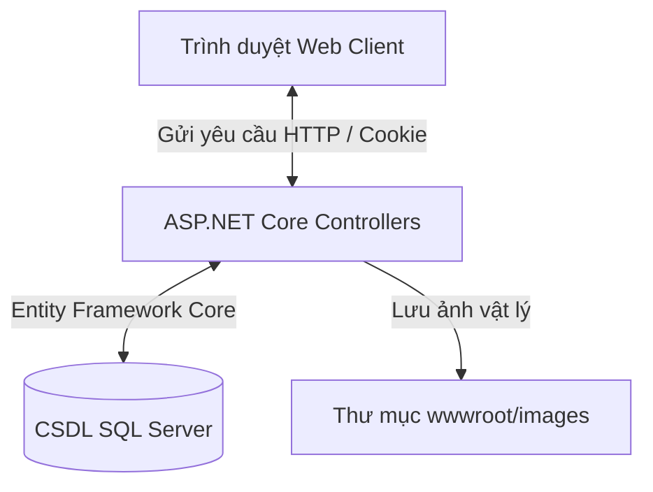

# 🚗 AutoPro - Hệ thống Quản lý Showroom Ô tô & Gara Cao Cấp

<p align="center">
  
  
  
  
  
</p>

---

## 📌 THÔNG TIN ĐỒ ÁN TỐT NGHIỆP

* **Đề tài:** Nghiên cứu và xây dựng hệ thống thông tin quản lý Showroom Ô tô & Gara cao cấp AutoPro
* **Chuyên ngành:** Công nghệ thông tin
* **Sinh viên thực hiện:** **Nguyễn Hoàng Lưu**
* **Giảng viên hướng dẫn:** **ThS. Mai Cường Thọ**
* **Đơn vị đào tạo:** Trường Đại Học Nha Trang

---

## 📖 GIỚI THIỆU DỰ ÁN

**AutoPro** là một ứng dụng web quản lý nội bộ hiện đại dành riêng cho các Showroom ô tô và Gara sửa chữa cao cấp. Hệ thống được xây dựng trên nền tảng **ASP.NET Core MVC** kết hợp với **SQL Server** và phong cách thiết kế **Obsidian Glassmorphism** (kính mờ trên nền tối thể thao) mang lại trải nghiệm quản trị trực quan, mượt mà và tối ưu hóa luồng vận hành của doanh nghiệp.



---

## 🛠️ CÔNG NGHỆ SỬ DỤNG

| Thành phần | Công nghệ chi tiết |
| :--- | :--- |
| **Backend Framework** | ASP.NET Core MVC (C#) |
| **ORM & Database Access** | Entity Framework Core (Eager Loading) |
| **Database** | Microsoft SQL Server |
| **Giao diện & UI** | Vanilla CSS (Glassmorphism & Obsidian Dark Theme), Bootstrap 5 |
| **Thư viện Thống kê** | Chart.js (Neon Doughnut Charts) |
| **Lưu trữ Hình ảnh** | Hệ thống tệp tin cục bộ (`wwwroot/images`) / CDN |

---

## ✨ CÁC CHỨC NĂNG NỔI BẬT

### 🔐 1. Xác thực & Bảo mật (Cookie Authentication Middleware)
* Hệ thống tự động chuyển hướng và chặn mọi truy cập trái phép nếu chưa đăng nhập.
* Sử dụng Cookie để duy trì trạng thái đăng nhập bảo mật cho phiên quản trị của Admin.

### 📊 2. Dashboard Thống kê Neon trực quan
* Tính toán tự động tổng doanh thu thực tế từ CSDL.
* Hiển thị tỷ lệ bán xe qua thanh Progress Bar neon.
* Biểu đồ Doughnut neon tích hợp thư viện **Chart.js** trực quan hóa hiệu suất kinh doanh của từng nhân viên chốt hợp đồng.

### 🏎️ 3. Quản lý Kho xe thông minh (Xes)
* Hiển thị danh sách xe dạng **Grid Card 3D** cực kỳ sang trọng kèm nhãn trạng thái (Sẵn sàng/Đã bán).
* Thanh tìm kiếm nhanh động lọc tức thời theo tên hãng, dòng xe hoặc số khung số máy.
* Logic nghiệp vụ tự động giải phóng đơn hàng liên quan khi chuyển trạng thái xe từ "Đã bán" về lại "Sẵn sàng".

### 👥 4. Quản lý Nhân sự với thẻ ID Live Preview
* Giao diện nhập liệu chia đôi độc đáo.
* Tích hợp JavaScript bắt sự kiện keyup giúp **đồng bộ thông tin trực tiếp sang mô hình thẻ ID nhân viên** ở cột bên trái trong thời gian thực.
* Thống kê danh sách hợp đồng đã chốt và tổng doanh số mang lại của từng nhân sự.

### 📜 5. Lập đơn hàng và tự động khóa xe (DonHangs)
* Dropdown chọn xe lập hợp đồng **tự động lọc bỏ các xe đã bán**, ngăn ngừa rủi ro bán trùng xe.
* Tự động khóa xe chuyển sang trạng thái `DaBan = true` ngay khi đơn hàng được lưu thành công.
* Khi hủy đơn hàng, hệ thống tự động mở khóa xe trả lại trạng thái `Sẵn sàng` trong kho.

---

## 🗄️ CẤU TRÚC CƠ SỞ DỮ LIỆU (ERD)

Cơ sở dữ liệu của ứng dụng gồm 4 bảng chính được chuẩn hóa tối ưu:

```mermaid
erDiagram
    XE {
        int Id PK
        varchar SoKhungSoMay "Unique"
        nvarchar HangXe
        nvarchar DongXe
        decimal GiaBan
        bit DaBan
    }
    HINHANHXE {
        int Id PK
        int XeId FK
        nvarchar DuongDanAnh
        bit LaAnhChinh
    }
    NHANVIEN {
        int Id PK
        nvarchar HoTen
        varchar SoDienThoai
        nvarchar ChucVu
    }
    DONHANG {
        int Id PK
        datetime NgayLap
        decimal GiaChot
        int NhanVienId FK
        int XeId FK "Unique"
    }

    XE ||--oI DONHANG : "được lập"
    XE ||--o{ HINHANHXE : "sở hữu ảnh"
    NHANVIEN ||--o{ DONHANG : "thực hiện chốt"
```

---

## 🚀 HƯỚNG DẪN CÀI ĐẶT & CHẠY DỰ ÁN

### 📋 Yêu cầu hệ thống
* .NET SDK 8.0 hoặc 9.0 trở lên.
* Microsoft SQL Server & SQL Server Management Studio (SSMS).
* Visual Studio 2022 hoặc VS Code.

### 🔌 Bước 1: Thiết lập Cơ sở dữ liệu
1. Mở SQL Server Management Studio và kết nối tới Server của bạn.
2. Tạo một cơ sở dữ liệu mới với tên `QLGR` hoặc chạy trực tiếp mã lệnh tạo trong tệp `QLGR.sql` có sẵn trong thư mục gốc dự án.
3. Chạy mã script SQL để khởi tạo các bảng và chèn dữ liệu mẫu ban đầu.

### ⚙️ Bước 2: Cấu hình Connection String
Mở tệp `QuanLyGara/QuanLyGara/appsettings.json` và cập nhật chuỗi kết nối SQL Server của bạn:

```json
"ConnectionStrings": {
  "DefaultConnection": "Server=YOUR_SERVER_NAME;Database=QLGR;Trusted_Connection=True;MultipleActiveResultSets=true;TrustServerCertificate=True"
}
```
*(Thay thế `YOUR_SERVER_NAME` bằng tên SQL Server instance của bạn)*

### 💻 Bước 3: Chạy ứng dụng bằng Terminal
Mở Command Prompt hoặc PowerShell tại thư mục chứa dự án `QuanLyGara/QuanLyGara` và thực hiện các lệnh sau:

```bash
# Phục hồi các gói thư viện NuGet
dotnet restore

# Biên dịch dự án
dotnet build

# Chạy server phát triển cục bộ
dotnet run
```

Sau khi ứng dụng khởi chạy thành công, mở trình duyệt và truy cập: **`https://localhost:5001`** hoặc **`http://localhost:5000`** (hoặc cổng port hiển thị trên terminal của bạn).

---

## 📄 LICENSE

Dự án này được cấp phép theo các điều khoản của giấy phép **MIT License**. Vui lòng tham khảo tệp LICENSE để biết thêm chi tiết.